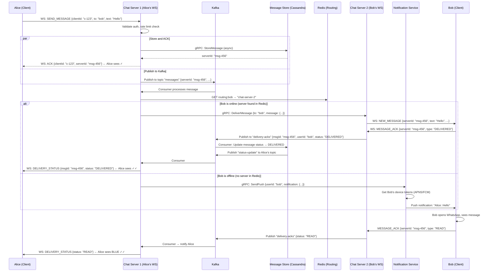

# ⚙️ Backend WhatsApp System Design
### Ultimate Google L5/L6 Interview Preparation Guide
> *"The best distributed systems engineers are the ones who've been hurt by their assumptions."*

---

## TABLE OF CONTENTS

| # | Section | Key Topics |
|---|---------|-----------|
| 1 | Problem Statement | Scope, Requirements |
| 2 | Requirement Clarification | Interview Communication |
| 3 | Capacity Estimation | Users, Traffic, Storage, Bandwidth |
| 4 | API Design | REST, WebSocket, gRPC |
| 5 | High Level Architecture | All Services Overview |
| 6 | Message Flow | End-to-End Sequence |
| 7 | Database Design | Schema, Indexes, Partitioning |
| 8 | Storage Design | SQL vs NoSQL vs Blob |
| 9 | Distributed Systems | CAP, Consistency, Consensus |
| 10 | Scaling | Sharding, Replication, Geo |
| 11 | Kafka | Topics, Ordering, DLQ |
| 12 | Caching | Redis, Hot Keys, TTL |
| 13 | Real-Time Messaging | Ordering, ACK, Deduplication |
| 14 | Group Messaging | Fan-out Strategies |
| 15 | Media Upload | Chunked, CDN, Virus Scan |
| 16 | End-to-End Encryption | Signal Protocol, Double Ratchet |
| 17 | Reliability | Circuit Breaker, Retry, Bulkhead |
| 18 | Failure Scenarios | Recovery Strategies |
| 19 | Monitoring | Metrics, Tracing, SLOs |
| 20 | Security | TLS, Rate Limiting, Spam |
| 21 | Cost Optimization | Storage, Compression, Lifecycle |
| 22 | Trade-offs | All Major Decisions |
| 23 | 100+ Interview Questions | Q&A Ready |
| 24 | Common Mistakes | Why Candidates Fail |
| 25 | Revision Cheat Sheet | One-Page Summary |
| 26 | Strong Hire Answers | What the Best Candidates Say |

---

# 1. 📋 PROBLEM STATEMENT

## What Are We Designing?

The **backend infrastructure** for WhatsApp — a real-time messaging system serving **2 billion+ global users**, processing **100 billion+ messages per day**, with sub-100ms delivery latency and 99.999% uptime.

> 🧠 **Memory Trick:** WhatsApp backend = **CREDS**
> - **C**onsistency of message ordering
> - **R**eliability of delivery
> - **E**nd-to-end encryption
> - **D**urability of messages
> - **S**calability to billions

## Scope (In Scope)

| Feature | Priority | Key Challenges |
|---------|----------|---------------|
| 1-on-1 real-time messaging | P0 | Sub-100ms latency, ordering |
| Group messaging (1024 members) | P0 | Fan-out, thundering herd |
| Media sharing (images, video, docs) | P0 | Storage, CDN, compression |
| Message delivery receipts | P0 | ACK, state machines |
| Online/offline presence | P1 | Hot-key Redis, eventual consistency |
| Push notifications | P1 | APNS, FCM, at-least-once |
| Multi-device support | P1 | Session sync, ordering |
| Message search | P2 | Inverted index, privacy |
| Status/Stories | P2 | TTL, fan-out |

## Out of Scope

```
❌ Voice/Video calls (WebRTC infrastructure)
❌ WhatsApp Business API platform
❌ Payments infrastructure
❌ Key management / PKI infrastructure (beyond protocol description)
❌ Spam ML model training
❌ Data export/GDPR tooling
```

---

# 2. 💬 REQUIREMENT CLARIFICATION

## Critical Questions to Ask

```
YOU:  "How many total and daily active users?"
      → 2B total, 500M DAU (adjust capacity accordingly)

YOU:  "What's the expected message volume?"
      → ~100B messages/day (~65B texts, ~35B media)

YOU:  "What consistency model is acceptable for messaging?
       Strong consistency (everyone sees same order) or
       eventual (each device converges eventually)?"
      → Eventual consistency is acceptable, but causal
        ordering must be preserved

YOU:  "Do we need to support message history? For how long?"
      → Yes, messages stored indefinitely (or until user deletes)

YOU:  "What's the target delivery SLA?"
      → P50 < 50ms, P99 < 200ms when both parties online

YOU:  "Multi-device: can I read on one device what I sent on another?"
      → Yes, full sync across 4 devices max

YOU:  "Group size limit?"
      → 1024 members (up from original 256)

YOU:  "Do we need end-to-end encryption?"
      → Yes, Signal Protocol. Keys managed client-side.
        Servers never see plaintext.
```

---

# 3. 📐 CAPACITY ESTIMATION

> 🎯 **Interviewer Expectation:** Show systematic estimation with reasonable assumptions. The exact numbers matter less than the **approach** and **implications** you draw from them.

## Users

```
Total Users:           2,000,000,000  (2B)
Daily Active Users:      500,000,000  (500M)
Concurrent Users:         50,000,000  (50M at peak, ~10% of DAU)
Messages/user/day:                 40  (mix of send/receive)
```

## Traffic

```
MESSAGES PER DAY:
  Text messages:     50M users × 40 msgs = 2,000,000,000 (2B texts/day)
  
  Wait — WhatsApp actually sends 100B messages/day (per public data)
  Let's use: 100,000,000,000 messages/day

MESSAGES PER SECOND:
  Peak QPS = 100B / 86,400s = 1,157,000 msg/s ≈ 1.2M msg/s
  Peak (3x average) = ~3.6M msg/s
  
  But messages are delivered to recipients too:
  Average recipients per message: 1.5 (some are group, most are 1-on-1)
  Delivery events = 1.2M × 1.5 = 1.8M delivery events/second
```

## Storage

```
TEXT MESSAGE:
  Content:       ~200 bytes (avg text)
  Metadata:      ~100 bytes (sender, timestamp, status, IDs)
  Total/message: ~300 bytes

TEXT STORAGE/DAY:
  65B text messages × 300 bytes = 19.5 TB/day

MEDIA:
  35B media messages
  Avg media size (compressed): ~100KB (images compressed)
  35B × 100KB = 3,500 TB/day = 3.5 PB/day  ← WOW

  Reality check: WhatsApp compresses before storing
  Compressed avg: 50KB
  35B × 50KB = 1.75 PB/day

TOTAL STORAGE/YEAR:
  Text:  19.5 TB/day × 365 = ~7 PB/year
  Media: 1.75 PB/day × 365 = ~640 PB/year ≈ 640 PB (massive!)
  
  THIS is why CDN, compression, and lifecycle policies are critical
```

## Bandwidth

```
INBOUND BANDWIDTH:
  1.2M messages/s × 300 bytes = 360 MB/s inbound

OUTBOUND BANDWIDTH:
  1.8M delivery events/s × 300 bytes = 540 MB/s
  Media: 35B/day ÷ 86,400s = 405,000 media requests/s
         × 50KB avg = ~20 GB/s for media

TOTAL BANDWIDTH: ~20+ GB/s (why we need global CDN!)
```

## Server Estimation

```
CHAT SERVERS (WebSocket connections):
  50M concurrent users ÷ 65,000 connections/server = 769 servers
  With 2x headroom: ~1,500 chat servers

  (Each server: 64 cores, 128GB RAM, 65k WebSocket connections
   = limited by file descriptor limits and RAM, not CPU)

DATABASE WRITES:
  1.2M messages/s — needs distributed write-optimized DB
  Cassandra: ~10,000 writes/s per node
  Required nodes: 1.2M ÷ 10,000 × 3x replication = 360 nodes

  This is why WhatsApp uses Cassandra-like HBase clusters
```

---

# 4. 🔌 API DESIGN

## External APIs

### WebSocket Protocol (Primary — Real-Time)

```
Client ──WS──► API Gateway ──► Chat Service

Connection:
  WSS: wss://chat.whatsapp.com/ws?token=<jwt>

Message format (binary for efficiency, JSON for clarity here):
{
  "type": "MESSAGE" | "ACK" | "TYPING" | "PRESENCE" | "PING",
  "payload": { ... }
}

Client → Server Events:
  SEND_MESSAGE    { clientId, conversationId, content, type, mediaId? }
  MESSAGE_ACK     { messageId, ackType: "DELIVERED" | "READ" }
  TYPING_START    { conversationId }
  TYPING_STOP     { conversationId }
  PING            {} (heartbeat every 30s)

Server → Client Events:
  NEW_MESSAGE     { messageId, clientId, senderId, content, timestamp }
  ACK_CONFIRMED   { clientId, serverId, timestamp }  (your send was received)
  DELIVERY_STATUS { messageId, userId, status, timestamp }
  TYPING          { conversationId, userId, action: "start"|"stop" }
  PRESENCE        { userId, status: "online"|"offline", lastSeen? }
  PONG            {}
```

### REST API (Management, History, Media)

```
Auth
  POST   /v1/auth/otp/request          Rate limited: 3/hour per phone
  POST   /v1/auth/otp/verify           Returns: access_token + refresh_token
  POST   /v1/auth/refresh              Uses httpOnly cookie
  DELETE /v1/auth/sessions/:sessionId  Multi-device logout

Users
  GET    /v1/users/me                  Current user profile
  PUT    /v1/users/me                  Update profile
  GET    /v1/users/:id/profile         Another user's public profile
  POST   /v1/users/search              Search by phone (privacy: only contacts)

Conversations
  GET    /v1/conversations             List (paginated, cursor-based)
  POST   /v1/conversations             Create 1-on-1
  GET    /v1/conversations/:id         Details

Messages
  GET    /v1/conversations/:id/messages?cursor=X&limit=50   History
  DELETE /v1/conversations/:id/messages/:msgId              Delete for me/everyone

Groups
  POST   /v1/groups                    Create group
  GET    /v1/groups/:id                Group info
  PUT    /v1/groups/:id                Update name/icon
  POST   /v1/groups/:id/members        Add members
  DELETE /v1/groups/:id/members/:uid   Remove member
  PUT    /v1/groups/:id/admins/:uid    Promote to admin

Media
  POST   /v1/media/upload-url          Get pre-signed S3 URL
  GET    /v1/media/:id                 Get media metadata (not content)
  DELETE /v1/media/:id                 Delete media

Status
  POST   /v1/status                    Post status
  GET    /v1/status/feed               Friends' statuses
  DELETE /v1/status/:id               Delete status
```

### Internal gRPC APIs

```protobuf
// Chat Service → Message Store Service
service MessageStore {
  rpc StoreMessage(StoreMessageRequest) returns (StoreMessageResponse);
  rpc GetMessages(GetMessagesRequest) returns (GetMessagesResponse);
  rpc UpdateMessageStatus(UpdateStatusRequest) returns (StatusResponse);
}

// Chat Service → Presence Service
service PresenceService {
  rpc GetPresence(GetPresenceRequest) returns (PresenceResponse);
  rpc SetPresence(SetPresenceRequest) returns (StatusResponse);
  rpc SubscribePresence(SubscribeRequest) returns (stream PresenceEvent);
}

// Notification Service → Push Service
service PushService {
  rpc SendPushNotification(PushRequest) returns (PushResponse);
  rpc SendBatchNotifications(BatchPushRequest) returns (BatchPushResponse);
}
```

---

# 5. 🏛️ HIGH LEVEL ARCHITECTURE

## Complete System Architecture

```
                            CLIENTS
                   (iOS, Android, Web, Desktop)
                              │
                     ┌────────┴────────┐
                     │    CloudFlare   │  ← DDoS protection, TLS termination
                     │  (Global CDN)   │
                     └────────┬────────┘
                              │
                  ┌───────────┴───────────┐
                  │      API GATEWAY      │  ← Auth, rate limiting, routing
                  │   (Kong / Envoy)      │
                  └──┬────────┬────────┬──┘
                     │        │        │
           ┌─────────┘        │        └─────────┐
           ▼                  ▼                   ▼
   ┌──────────────┐  ┌──────────────┐  ┌──────────────┐
   │   CHAT        │  │    REST       │  │    MEDIA      │
   │  SERVICE      │  │   SERVICE     │  │   SERVICE     │
   │ (WebSocket)   │  │ (HTTP/2)      │  │ (Upload/CDN)  │
   └──────┬────────┘  └──────┬────────┘  └──────┬────────┘
          │                  │                    │
          ├──────────────────┴────────────────────┤
          │                                        │
          ▼                                        ▼
   ┌──────────────────────────────────────────────────────┐
   │                  MESSAGE BUS (KAFKA)                  │
   │  Topics: messages, delivery-acks, notifications,      │
   │          group-fanout, media-events, audit            │
   └────────┬───────────────────────────────────┬─────────┘
            │                                   │
   ┌─────────┴──────────┐              ┌────────┴─────────┐
   │  FANOUT SERVICE    │              │  NOTIFICATION    │
   │  (Group delivery)  │              │  SERVICE         │
   └─────────┬──────────┘              │  (APNS/FCM)     │
             │                          └────────┬─────────┘
             │                                   │
   ┌─────────▼──────────────────────────────────▼─────────┐
   │                    SHARED SERVICES                    │
   │  ┌──────────────┐  ┌──────────────┐  ┌────────────┐ │
   │  │   PRESENCE   │  │  AUTH/USER   │  │  SEARCH    │ │
   │  │   SERVICE    │  │   SERVICE    │  │  SERVICE   │ │
   │  └──────────────┘  └──────────────┘  └────────────┘ │
   └───────────────────────────────────────────────────────┘
          │                   │                    │
   ┌──────┴───────┐   ┌───────┴───────┐   ┌───────┴────────┐
   │    REDIS     │   │   CASSANDRA   │   │   POSTGRESQL   │
   │  (Presence,  │   │   (Messages)  │   │  (Users,Groups)│
   │   Sessions,  │   │               │   │                │
   │   Pub/Sub)   │   │               │   │                │
   └──────────────┘   └───────────────┘   └────────────────┘
                                │
                        ┌───────┴────────┐
                        │   S3 / GCS     │
                        │  (Media Blobs) │
                        └───────┬────────┘
                                │
                        ┌───────┴────────┐
                        │  CLOUDFRONT    │
                        │ / FASTLY CDN   │
                        └────────────────┘
```

## Service Responsibilities

| Service | Responsibility | Tech |
|---------|---------------|------|
| API Gateway | Auth verification, rate limiting, routing, TLS | Kong / Envoy |
| Chat Service | WebSocket connections, message routing | Go + gRPC |
| REST Service | User management, chat history, group ops | Go |
| Presence Service | Online/offline status, last seen | Go + Redis |
| Fanout Service | Group message delivery to all members | Go + Kafka |
| Notification Service | Push to offline users (APNS/FCM) | Go |
| Media Service | Upload coordination, compression, CDN | Go |
| Search Service | Message search (opt-in, no E2E content) | Elasticsearch |
| Auth Service | OTP, JWT issue/revoke, session management | Go + Redis |

---

# 6. 📨 MESSAGE FLOW

## 1-on-1 Message — Complete Sequence



## Key Insight: Why Two Stages?

```
Stage 1 (Synchronous): Client → Chat Server → ACK back to sender
  Latency: < 10ms
  Goal: Tell sender "we have it, don't worry"

Stage 2 (Asynchronous): Chat Server → Kafka → Delivery
  Latency: 10-200ms
  Goal: Reliable delivery, fan-out, notification
  
This decoupling is why WhatsApp can accept messages
even when the recipient's server is overloaded.
```

---

# 7. 🗃️ DATABASE DESIGN

## Database Technology Choices

| Data Type | Database | Why |
|-----------|---------|-----|
| Messages | Cassandra / HBase | Write-heavy, time-series, scale to PB |
| Users & Contacts | PostgreSQL | ACID, complex queries, relationships |
| Groups | PostgreSQL | Relational, transactional membership |
| Sessions & Presence | Redis | Sub-millisecond, TTL, pub/sub |
| Search Index | Elasticsearch | Full-text, relevance scoring |
| Media Metadata | Cassandra | High write volume, accessed by mediaId |

## Cassandra Message Schema

```cql
-- Messages table optimized for "give me last N messages in this chat"
CREATE TABLE messages (
  conversation_id  UUID,           -- Partition key
  message_id       TIMEUUID,       -- Clustering key (time-ordered!)
  sender_id        UUID,
  content          BLOB,           -- Encrypted payload
  message_type     TINYINT,        -- 0=text, 1=image, 2=video, 3=audio, 4=doc
  status           TINYINT,        -- 0=sent, 1=delivered, 2=read
  reply_to_id      UUID,           -- Quoted message
  media_id         UUID,
  client_id        UUID,           -- For deduplication
  deleted_for      SET<UUID>,      -- Users who deleted this message
  created_at       TIMESTAMP,
  PRIMARY KEY ((conversation_id), message_id)
) WITH CLUSTERING ORDER BY (message_id DESC)   -- Newest first
  AND COMPACTION = {'class': 'TimeWindowCompactionStrategy',
                    'compaction_window_size': '7',
                    'compaction_window_unit': 'DAYS'}
  AND TTL = 0; -- Keep forever unless soft-deleted
```

> 🧠 **Key Insight:** Using `TIMEUUID` (Version 1 UUID = timestamp + MAC address) as clustering key gives us **time-ordered storage** for free. No separate timestamp index needed. Reading "last 50 messages" = single partition scan.

## Why Cassandra for Messages?

```
WRITE PATTERN: 1.2M messages/second
  - Cassandra: append-only writes to SSTable → 100,000+ writes/s per node
  - PostgreSQL: UPDATE-heavy, B-Tree index → ~10,000 writes/s per node
  
READ PATTERN: "Get last 50 messages in conversation X"
  - Perfect for Cassandra: (conversation_id) is partition key
  - All messages for a conversation on the same node set
  
SCALE: PB of data
  - Cassandra: horizontal scale-out, no single point of write bottleneck
  - PostgreSQL: vertical scale + complex sharding needed
  
TRADE-OFF: No JOINs, no transactions across partitions
  - For messages: we don't need JOINs! Just give me conv_id → messages
```

## PostgreSQL User Schema

```sql
CREATE TABLE users (
  id           UUID PRIMARY KEY DEFAULT gen_random_uuid(),
  phone        VARCHAR(20) UNIQUE NOT NULL,
  display_name VARCHAR(100),
  about        VARCHAR(500),
  avatar_media_id UUID,
  last_seen    TIMESTAMP,
  is_active    BOOLEAN DEFAULT true,
  created_at   TIMESTAMP DEFAULT CURRENT_TIMESTAMP,
  updated_at   TIMESTAMP DEFAULT CURRENT_TIMESTAMP
);

CREATE INDEX idx_users_phone ON users(phone);
CREATE INDEX idx_users_last_seen ON users(last_seen); -- For presence queries

-- Contacts (which users are in whose contact list)
CREATE TABLE contacts (
  owner_id     UUID REFERENCES users(id) ON DELETE CASCADE,
  contact_id   UUID REFERENCES users(id) ON DELETE CASCADE,
  display_name VARCHAR(100), -- Override contact's display name
  is_blocked   BOOLEAN DEFAULT false,
  created_at   TIMESTAMP DEFAULT CURRENT_TIMESTAMP,
  PRIMARY KEY (owner_id, contact_id)
);

CREATE INDEX idx_contacts_contact_id ON contacts(contact_id);
-- Used for: "who has user X in their contacts?" (for privacy settings)
```

## Group Schema

```sql
CREATE TABLE groups (
  id           UUID PRIMARY KEY DEFAULT gen_random_uuid(),
  name         VARCHAR(100) NOT NULL,
  description  VARCHAR(500),
  icon_media_id UUID,
  invite_link  VARCHAR(100) UNIQUE,
  max_members  INTEGER DEFAULT 1024,
  created_by   UUID REFERENCES users(id),
  created_at   TIMESTAMP DEFAULT CURRENT_TIMESTAMP
);

CREATE TABLE group_members (
  group_id   UUID REFERENCES groups(id) ON DELETE CASCADE,
  user_id    UUID REFERENCES users(id) ON DELETE CASCADE,
  role       SMALLINT DEFAULT 0, -- 0=member, 1=admin, 2=super_admin
  joined_at  TIMESTAMP DEFAULT CURRENT_TIMESTAMP,
  added_by   UUID REFERENCES users(id),
  PRIMARY KEY (group_id, user_id)
);

CREATE INDEX idx_group_members_user ON group_members(user_id);
-- Critical: "which groups is user X in?" for message delivery routing
```

## Redis Data Structures

```
# Presence (online status)
Key:   presence:{userId}
Type:  Hash
Value: { status: "online", server: "chat-srv-42", connected_at: 1234567890 }
TTL:   60 seconds (refreshed by heartbeat every 30s)

# Routing (which chat server holds user's WS connection)
Key:   ws_server:{userId}
Type:  String
Value: "chat-server-42"
TTL:   60 seconds

# Session
Key:   session:{userId}:{deviceId}
Type:  Hash
Value: { jwt_jti: "...", device_type: "ios", last_active: ... }
TTL:   30 days

# Rate Limiting (per user, per minute)
Key:   rate:{userId}:msg:{minute}
Type:  String (counter)
Value: "47"  (number of messages sent this minute)
TTL:   120 seconds (2 minutes for safety)

# Conversation last read (for unread count)
Key:   last_read:{userId}:{conversationId}
Type:  String
Value: "msg-uuid-456" (last read message ID)
TTL:   None

# Group member cache (to avoid PostgreSQL on every message)
Key:   group_members:{groupId}
Type:  Set
Value: {userId1, userId2, ..., userId1024}
TTL:   5 minutes (or invalidated on member change)
```

---

# 8. 🗂️ STORAGE DESIGN

## Multi-Tier Storage Strategy

```
HOT STORAGE (Sub-millisecond access)
├── Redis Cluster
│   ├── Presence data (online status, routing table)
│   ├── Rate limiting counters
│   ├── Session data
│   └── Hot conversation metadata

WARM STORAGE (Low-latency, recent data)
├── Cassandra Cluster
│   ├── All messages (recent ones in OS page cache = fast)
│   ├── Media metadata
│   └── Delivery receipts

COOL STORAGE (High-capacity, less frequent access)
├── S3 / GCS (Object Storage)
│   ├── Media files (images, videos, documents, voice)
│   ├── Profile pictures
│   └── Status media

COLD STORAGE (Cheap, archival)
├── S3 Glacier / GCS Nearline
│   ├── Messages older than 2 years (if needed by law)
│   └── Compressed media archives
```

## Media Storage Architecture

```
UPLOAD FLOW:
Client → Pre-signed URL Request → Backend
Backend → Generate S3 Pre-signed URL → Client
Client → PUT directly to S3 (bypasses our servers!)
Client → Notify backend: "media uploaded" with S3 key
Backend → Trigger async: compress, thumbnail, virus scan
Backend → Update media record: status=READY, CDN_URL=...
Client → Sends message with mediaId

SERVING FLOW:
Recipient requests media → CDN checks cache
  Cache HIT → Serve from CDN (< 10ms)
  Cache MISS → CDN fetches from S3, caches → Serve

URL SIGNING:
  Media URLs are pre-signed with 24-hour expiry
  Recipient must be authenticated to get the signed URL
  This ensures only authorized users can view media
```

---

# 9. 🌐 DISTRIBUTED SYSTEMS

## CAP Theorem for WhatsApp

```
CAP THEOREM: You can only guarantee 2 of 3:
  C - Consistency  (everyone sees same data at same time)
  A - Availability (every request gets a response)
  P - Partition Tolerance (system works despite network splits)

WhatsApp CHOICE: AP (Availability + Partition Tolerance)

WHY?
  - Network partitions ARE going to happen (choose P always)
  - Between C and A: we choose A
  - Users expect to ALWAYS be able to send messages
  - A brief period of inconsistency (message order, delivery status)
    is acceptable. The message ARRIVING is not negotiable.

IMPLICATION:
  - Messages might appear in slightly different order on different devices
  - Delivery status might lag by seconds
  - But the message ALWAYS eventually arrives ← this is the contract
```

## PACELC Analysis

```
PACELC: If Partition → else (no partition) → choose Latency or Consistency

For WhatsApp:
  IF PARTITION:    Choose A over C (stay available)
  ELSE (normal):   Choose L over C (low latency over strong consistency)

This means:
  - Normal operation: messages stored with eventual consistency
  - No global locking, no 2PC for writes
  - Clients do client-side ordering + server assigns monotonic IDs
  - Conflicting operations (two people delete same group at once) → last-write-wins
```

## Consistency in Practice

```
MESSAGES (Eventual Consistency):
  - Cassandra: write to quorum (W = majority of replicas)
  - Read from one replica (R = 1) for speed
  - W + R > N? No — we trade read consistency for latency
  - Conflict: Cassandra uses timestamps, latest wins
  - Acceptable: recipient might get messages slightly out of order

GROUP MEMBERSHIP (Stronger Consistency):
  - PostgreSQL with synchronous replication
  - Transactions for add/remove member
  - Consistency matters: can't send to someone who just left

PRESENCE (Weak Consistency):
  - "Alice is online" can be stale by 60s
  - Redis: single master, async replica writes
  - Acceptable: presence is a hint, not a guarantee
```

## Leader Election

```
WHY NEEDED: Chat Service has many instances.
When a user reconnects, they must land on the same server
(or their messages must be routed to their new server).

APPROACH: Consistent Hashing + Redis

1. When user connects to chat-server-N:
   Redis.SET("ws_server:{userId}", "chat-server-N", EX=60)

2. When chat-server-M wants to deliver to user:
   server = Redis.GET("ws_server:{userId}")
   gRPC.Deliver(server, message)

3. If server dies:
   Redis TTL expires after 60s
   User reconnects to any available server
   New server sets its own key
   
No Paxos/Raft needed here — Redis is our "routing registry"
```

---

# 10. 📈 SCALING

## Horizontal Scaling of Chat Servers

```
CHALLENGE: 50M concurrent WebSocket connections

SOLUTION: Stateless chat servers + Redis routing

Each chat server:
  - Holds ~65,000 WebSocket connections (OS file descriptor limit)
  - Is stateless: no local state that can't be lost
  - Registers user routing in Redis on connect
  - Deregisters on disconnect

Scaling: Need to serve a user?
  1. Look up their server in Redis
  2. gRPC call to that specific server
  3. That server pushes via WebSocket to client

ADDING CAPACITY: Just add more chat servers!
  New server joins → starts accepting connections
  Load balancer distributes new connections to it
  Old connections stay on old servers (sticky L4)
```

## Database Sharding

```
CASSANDRA MESSAGES:
  Natural shard key: conversation_id
  All messages for a conversation on same partition
  Cassandra handles distribution via consistent hashing on partition key
  
  Problem: "Hot" conversation (group with 1024 members, very active)
    → One partition gets hammered
  Solution:
    1. Cassandra handles hot partition via read replicas
    2. For EXTREMELY hot groups: Redis cache for recent messages
    3. Limit message rate in large groups (WhatsApp throttles)

POSTGRESQL USERS:
  Single PostgreSQL doesn't scale to 2B users
  Options:
    a) Shard by user_id (first 2 hex chars → 256 shards)
    b) PlanetScale (MySQL-compatible, horizontal sharding)
    c) CitusDB (PostgreSQL extension for sharding)
  
  WhatsApp reality: Started with small user counts, grew into sharding
```

## Read Replicas & Caching Hierarchy

```
REQUEST: "Get conversation list for user X"

Layer 1: Redis Cache (hit → 0ms)
  Key: conv_list:{userId}
  TTL: 5 minutes
  Content: JSON of last 20 conversations

Layer 2: PostgreSQL Read Replica (hit → 5ms)
  SELECT * FROM conversations WHERE user_id = X ORDER BY last_msg_at DESC
  Multiple read replicas: distribute read load

Layer 3: PostgreSQL Primary (write target, also handles cache miss reads)
  
Cache invalidation:
  On new message: 
    Redis.DEL("conv_list:{recipientId}")   ← evict their conversation list
    Redis.DEL("conv_list:{senderId}")       ← evict sender's list
  Simple eviction vs complex update
```

## Geo-Distribution

```
ARCHITECTURE:
  ├── US-East (Primary region)
  ├── EU-West (Data sovereignty, GDPR)
  ├── Asia-Pacific (Latency for 60% of users)
  └── South America (Growing market)

ROUTING:
  CloudFlare AnyCast routes user to nearest region
  Each region has full stack (Chat, Kafka, Cassandra, Redis)
  
CROSS-REGION MESSAGING:
  Alice (US) → Bob (India)
  1. Alice's message accepted by US region chat server
  2. Kafka global replication to AP region
  3. AP Kafka consumer delivers to Bob's AP chat server
  4. Latency: ~200ms (acceptable for async messaging)

DATA RESIDENCY:
  EU users' data stays in EU (GDPR)
  WhatsApp routes EU→EU messages within EU
  Cross-region: only metadata, not content (E2E encrypted)
```

---

# 11. 📨 KAFKA

## Kafka Architecture for WhatsApp

```
TOPICS:
  messages           → New messages to be delivered
  delivery-acks      → Recipient acknowledges delivery/read
  group-fanout       → Triggers fan-out service for group msgs
  notifications      → Offline user push notification queue
  media-events       → Media uploaded, trigger processing
  audit              → All events for compliance/analytics
  dead-letter        → Failed messages after max retries

PARTITION STRATEGY:
  Topic: messages
  Partition key: conversation_id (for ordering within a chat)
  
  WHY: All messages in a conversation → same partition → same consumer
        guarantees order within a conversation
  
  Partitions: 500 (supports 500 concurrent consumers)
  Replication: 3 (ISR = 3, acks = all)
  
  Formula for partitions:
    Target throughput: 1.2M msg/s
    Per partition throughput: ~100K msg/s
    Required partitions: 1.2M ÷ 100K = 12 partitions (minimum)
    With headroom: 500 partitions
```

## Kafka Configuration

```yaml
# Producer config (Chat Service → Kafka)
acks: all              # Wait for all replicas
retries: 2147483647    # Retry effectively forever
max.in.flight.requests.per.connection: 1  # Preserve ordering
enable.idempotence: true   # Exactly-once producer
compression.type: lz4  # Fast compression

# Consumer config (Fanout/Notification consumers)
group.id: fanout-service
auto.offset.reset: earliest
enable.auto.commit: false   # Manual commit (after processing)
max.poll.records: 500       # Process 500 messages per poll
```

## Message Ordering Guarantees

```
WITHIN A CONVERSATION: ✅ Guaranteed
  conversation_id → same partition → single consumer → ordered

ACROSS CONVERSATIONS: ❌ Not guaranteed
  Different conversations on different partitions
  Two messages to different people may arrive "out of order" at topic level
  BUT: each recipient sees their own conversation in order ✅

GROUP MESSAGES:
  "Alice sends msg-1 and msg-2 to a group"
  Both use group's conversation_id → same partition → ordered ✅

MULTI-DEVICE ORDERING:
  Alice on iPhone sends msg while same Alice on iPad sends msg
  Both on different partitions → might arrive out of order at group
  Solution: Server-assigned monotonic sequence number per conversation
  Client uses this to sort, not arrival time
```

## Dead Letter Queue

```
FLOW:
  Message fails delivery (recipient chat server unreachable)
  Retry: 3 times with exponential backoff (1s, 2s, 4s)
  Still fails: move to DLQ topic (dead-letter)
  
DLQ PROCESSOR:
  Runs every minute
  For each DLQ message:
    - Check if recipient has reconnected
    - Retry delivery
    - If expired (72 hours): mark as permanently undelivered
    - Send notification to sender: "Message delivery failed"
    
  Why 72 hours? WhatsApp's actual retention period for undelivered messages.
  After that, message is dropped (this is documented behavior).
```

---

# 12. 💾 CACHING

## Redis Architecture

```
CLUSTER TOPOLOGY:
  6 Redis nodes in cluster mode
  3 master shards (16,384 hash slots / 3 = ~5,461 slots each)
  3 replica nodes (1 replica per master)
  
  Total RAM: 6 nodes × 64GB = 384GB RAM for cache

CRITICAL KEYS (most accessed):

  presence:{userId}     → Read on every message send
    Pattern: READ 1.2M/s, WRITE 1M/s
    Size: ~200 bytes × 500M users = 100GB ← Fits in RAM!
    Strategy: Write through (set on connect/heartbeat)

  ws_server:{userId}    → Read on every cross-server delivery
    Pattern: READ 1.2M/s, WRITE (only on connect/disconnect)
    Co-locate with presence key (same hash slot if possible)
    Strategy: Write through

  rate:{userId}:*       → Every message write
    Short-lived (60s), small value (counter)
    Strategy: Write-back (can afford to lose on Redis crash)
```

## Hot Key Problem

```
SCENARIO:
  Celebrity account with 50M followers posts a status
  Everyone checks their status → 50M reads to presence:{celebrity}
  Single Redis slot = single Redis node = HOT KEY

SOLUTIONS:

1. Local Cache (Best for read-heavy hot keys)
   Each application server keeps 1000 most-read keys locally
   LRU cache, 1-second TTL
   Reduces Redis load by 99%

2. Key Sharding (Distributed reads)
   presence:{celebrity}#shard-1
   presence:{celebrity}#shard-2
   ...
   presence:{celebrity}#shard-32
   Each shard on different Redis node
   Read from random shard → 32x reduced load per node

3. Consistent Read Replicas
   Dedicated replicas for high-traffic keys
   Reads go to replica, writes to master

WhatsApp uses: #1 (local app cache) for presence
WHY: 1 second staleness for presence is totally acceptable
```

## Cache Invalidation Strategy

```
STRATEGY BY DATA TYPE:

Messages:
  → Write-through to Cassandra (source of truth)
  → Cassandra is the cache? No — recent messages stay in OS page cache
  → Redis NOT used for message storage (too expensive for PB of data)
  
Conversation metadata (last message, unread count):
  → Redis hash per user
  → Invalidate on new message (DEL key)
  → Next request regenerates from DB
  → Simple: TTL-based expiry (5 min)

Group membership:
  → Redis SET for member list
  → Invalidate on member add/remove (SREM/SADD)
  → TTL: 5 minutes
  → Trade-off: 5-min window where removed member still receives messages
    Fix: Check DB on message receive before delivering → adds latency
    Production choice: Accept 5-min delay (WhatsApp's actual behavior)

Presence:
  → TTL-based: set TTL=60s, refresh every 30s
  → No explicit invalidation needed
  → "Gone offline" = stop refreshing → TTL expires naturally
```

---

# 13. 📡 REAL-TIME MESSAGING

## Message Ordering

```
PROBLEM: Alice sends message A then B. Network issues.
          Server receives B before A.
          Bob sees "B" then "A" — WRONG ORDER.

SOLUTION: Multi-layer ordering

Layer 1: Client-side sequence numbers
  Alice timestamps and sequences every message:
  { clientId: "c-1", seq: 42, timestamp: 1234567890.123 }
  { clientId: "c-2", seq: 43, timestamp: 1234567890.234 }

Layer 2: Server-assigned monotonic ID per conversation
  Server receives both. Assigns:
  A → conversationSeq: 100
  B → conversationSeq: 101
  Even if B arrived first, if server sees seq:43 missing,
  it holds B briefly (50ms) waiting for A.

Layer 3: Client re-orders on display
  Client sorts by conversationSeq, not arrival time
  
RESULT: Bob sees A then B, always.
```

## Message Deduplication

```
PROBLEM: Network failure during send.
          Client retries. Server processed the first send.
          Server now gets SAME message twice → Bob sees duplicate.

SOLUTION: Idempotency keys (clientId)

1. Client generates UUID for each message (clientId)
2. Client stores {clientId, content} in IndexedDB before sending
3. Server checks: "Have I seen clientId 'c-123' before?"
   - Check Redis SET (dedupe_ids:{conversation_id}, TTL=24hr)
   - If found: return the existing serverId, DON'T store again
   - If not found: store, add to Redis SET, return new serverId
4. Client receives same serverId for both sends → deduplicates

Redis SET operation:
  SADD dedupe_ids:{conversation_id} {clientId}  → 1 if new, 0 if duplicate
  Time: O(1) — perfect for 1.2M msg/s
  TTL: 24 hours (clients retry within this window)
```

## ACK Flow Implementation

```
LEVELS OF ACKNOWLEDGMENT:

Level 1: Server received it (Server ACK)
  Client → Server: SEND_MESSAGE {clientId: "c-1"}
  Server → Client: ACK {clientId: "c-1", serverId: "s-1"} ← "I have it"
  Client: Show ✓ (single tick)
  
Level 2: Delivered to recipient device (Delivery ACK)
  Server delivers to Bob's device
  Bob's client → Server: DELIVERY_ACK {serverId: "s-1"}
  Server → Alice: DELIVERY_NOTIFICATION {serverId: "s-1", status: DELIVERED}
  Alice's client: Show ✓✓ (double tick)
  
Level 3: Read by recipient (Read ACK)
  Bob opens the conversation, message is visible
  Bob's client → Server: READ_ACK {serverId: "s-1"}
  Server → Alice: DELIVERY_NOTIFICATION {serverId: "s-1", status: READ}
  Alice's client: Show 💙✓✓ (blue double tick)

BATCH ACKs:
  When Bob opens a conversation with 50 unread messages,
  DON'T send 50 individual READ_ACKs.
  Send: READ_UP_TO {conversationId, lastReadId: "s-50"}
  Server: mark all messages up to s-50 as read for Bob
  Reduces: 50 requests → 1 request
```

---

# 14. 👥 GROUP MESSAGING

## Fan-out Strategies

```
PROBLEM: Alice sends a message to a group with 1000 members.
          The server must deliver to all 1000 members.
          
APPROACH 1: Fan-out on Write (Push Model)
  When message received:
    → Look up 1000 members
    → Deliver to each member's chat server (or push notification)
    
  PROS: Recipients see message instantly when they open the app
  CONS: For 1000 members × 1.2M group messages/day = 1.2B fan-out events
        Thundering herd: busy groups create huge spikes
  
APPROACH 2: Fan-out on Read (Pull Model)
  When message received:
    → Store message in group's conversation
    → Members "pull" when they open the app
    
  PROS: Low write amplification
  CONS: Every app open → poll for new messages → high read load
        Latency for large groups

APPROACH 3: Hybrid (WhatsApp Approach)
  For SMALL groups (< 200 members): Fan-out on Write
    Fast delivery, manageable amplification
    
  For LARGE groups (200-1024 members): Hybrid
    - Online members: Fan-out on Write via their chat server
    - Offline members: Pull when they come online
    - Push notification: Generic "new messages in Group X"
```

## Fan-out Implementation

```
Kafka Consumer (group-fanout topic):

async def process_group_message(message: GroupMessage):
    group_id = message.group_id
    sender_id = message.sender_id
    
    # 1. Get members (from Redis cache or PostgreSQL)
    members = await redis.smembers(f"group_members:{group_id}")
    if not members:
        members = await db.get_group_members(group_id)
        await redis.sadd(f"group_members:{group_id}", *members)
        await redis.expire(f"group_members:{group_id}", 300)
    
    # 2. Batch the fan-out (don't do 1000 sequential operations!)
    online_members = []
    offline_members = []
    
    # Batch Redis lookup for all members' presence
    pipe = redis.pipeline()
    for member_id in members:
        if member_id != sender_id:
            pipe.get(f"ws_server:{member_id}")
    servers = await pipe.execute()
    
    for member_id, server in zip(members, servers):
        if server:
            online_members.append((member_id, server))
        else:
            offline_members.append(member_id)
    
    # 3. Deliver to online members (batch gRPC)
    await deliver_to_online(online_members, message)
    
    # 4. Send push notifications to offline members (batch)
    await send_push_notifications(offline_members, message)
    
    # 5. Publish delivery acks back to sender
```

## Group Thundering Herd

```
SCENARIO: Large WhatsApp group (1000 members) receives a message.
           1000 devices get push notification simultaneously.
           All 1000 devices wake up and open the app at ~same time.
           1000 WebSocket connections established in 2 seconds.
           = 500 connections/second spike × number of groups = CHAOS

SOLUTION: Staggered notifications

For groups > 100 members:
  Batch notifications into waves:
    Wave 1 (0ms):   Online members get direct delivery
    Wave 2 (0ms):   Online mobile devices get push
    Wave 3 (5s):    First 100 offline members get push
    Wave 4 (10s):   Next 100 offline members get push
    ...
    Wave N (N*5s):  Last batch
    
  Result: 1000 reconnections spread over ~50 seconds
          vs 1000 in 2 seconds
          
  This is analogous to how CDNs stagger cache warming.
```

---

# 15. 🖼️ MEDIA UPLOAD

## Complete Media Pipeline

```
UPLOAD:
┌──────┐    1. Request URL    ┌─────────┐
│Client│ ──────────────────► │ Backend │
│      │ ◄────────────────── │         │
│      │    2. Pre-signed URL │         │
│      │                      └─────────┘
│      │    3. PUT file bytes
│      │ ──────────────────► ┌─────────┐
│      │ ◄────────────────── │   S3    │
│      │    4. HTTP 200       └────┬────┘
│      │                           │ Event: ObjectCreated
│      │    5. Send message        ▼
│      │    with mediaId    ┌─────────────┐
│      │ ──────────────────►│  Lambda /   │
│      │                    │  Worker     │
└──────┘                    │ (Compress,  │
                            │  Thumbnail, │
                            │  Virus Scan)│
                            └─────────────┘
```

## Chunked Upload for Large Files

```
WHY: Videos can be 100MB+. Single PUT fails on network issues.
      Must be resumable.

ALGORITHM (tus.io protocol — WhatsApp uses similar):

1. Client: POST /media/upload-sessions
   → Response: { uploadId: "upload-123", chunkSize: 5MB }

2. Client splits file into chunks (5MB each)
   file.size = 50MB → 10 chunks

3. Client: PATCH /media/upload-sessions/upload-123/chunks/0
   Headers: Content-Range: bytes 0-5242879/52428800
   Body: [chunk 0 bytes]
   → Response: 206 Partial Content

   ...repeat for chunks 1-8...

4. Client: PATCH .../chunks/9 (last chunk)
   → Response: 201 Created { mediaId: "media-456", url: "..." }

RESUME:
   Network dies after chunk 4.
   Client: HEAD /media/upload-sessions/upload-123
   → Response: { receivedBytes: 26214400 } (i.e., chunks 0-4)
   Client resumes from chunk 5.
```

## Media Processing Pipeline

```
S3 Event → SQS Queue → Media Worker

Media Worker (Go):
1. VALIDATE
   - Check file signature (magic bytes), not just extension
   - JPEG: FF D8 FF | PNG: 89 50 4E 47 | GIF: 47 49 46
   - Reject mismatched type (attacker uploads .exe as .jpg)

2. VIRUS SCAN
   - ClamAV scan (for documents)
   - Hash-based blocklist check (known CSAM/malware hashes)
   - Quarantine on fail

3. COMPRESS
   - Images: WebP conversion (30-50% smaller) + quality reduction
   - Video: H.264 re-encode to max 720p for preview, keep original
   - Audio: Opus 48kbps for voice messages

4. THUMBNAIL
   - Images: 200×200 JPEG thumbnail (for conversation list)
   - Video: Extract first frame
   - Documents: First page render (PDF)

5. STORE
   - Original: s3://wa-media-originals/{region}/{mediaId}
   - Compressed: s3://wa-media-cdn/{region}/{mediaId}
   - Thumbnail: s3://wa-media-thumbs/{region}/{mediaId}

6. CACHE & SERVE
   - CloudFront distribution in front of S3
   - Cache-Control: max-age=31536000 (1 year — immutable content)
   - URL includes version hash: media.whatsapp.net/{hash}/{mediaId}
```

---

# 16. 🔐 END-TO-END ENCRYPTION

## Signal Protocol Overview

```
WHY SIGNAL PROTOCOL?
  WhatsApp adopted Signal Protocol in 2016.
  Provides: Perfect Forward Secrecy (PFS) + Post-Compromise Security (PCS)

  PFS: Even if long-term keys are compromised,
       past messages cannot be decrypted.
  
  PCS: If keys are compromised, future messages
       are secure once new keys are established.

COMPONENTS:
  1. Identity Key Pair (IK): Long-term, per device
  2. Signed PreKey (SPK): Medium-term (~weekly rotation)
  3. One-Time PreKeys (OPKs): Single use, 100 pre-generated
  4. Ephemeral Key: Per-session

WhatsApp SERVER stores PUBLIC keys only.
Private keys NEVER leave the device.
Server can't decrypt messages even with a court order.
```

## Double Ratchet Algorithm

```
ANALOGY: It's like a key chain where:
  - You use each key once
  - After each use, you generate the NEXT key from the current one
  - Even if someone steals your current key, they can't get PAST keys
    (can't go backwards on the ratchet)

TWO RATCHETS:

1. Diffie-Hellman Ratchet (for new sessions)
   - Alice and Bob exchange DH values with each message
   - New shared secret derived with each exchange
   - Provides PCS (future security after compromise)

2. Symmetric Ratchet (within a session)
   - KDF chain: Key Derivation Function on current key → message key + next chain key
   - Each message key used exactly once
   - Provides PFS (past messages safe)

SIMPLIFIED FLOW:

Alice wants to send first message to Bob:

1. Alice fetches Bob's public keys from WhatsApp server:
   - Identity Public Key (IKb)
   - Signed PreKey (SPKb)
   - One-Time PreKey (OPKb)

2. Alice computes shared secret via X3DH (Extended Triple DH):
   DH1 = DH(IKa, SPKb)    ← Alice identity + Bob signed prekey
   DH2 = DH(EKa, IKb)     ← Alice ephemeral + Bob identity
   DH3 = DH(EKa, SPKb)    ← Alice ephemeral + Bob signed prekey
   DH4 = DH(EKa, OPKb)    ← Alice ephemeral + Bob one-time prekey
   SK = KDF(DH1 || DH2 || DH3 || DH4)  ← Master Secret

3. Shared secret SK used to initialize Double Ratchet

4. Message encrypted with derived message key
   Bob can decrypt using same keys (computed independently)

5. OPK consumed — Bob uploads new OPK to server
```

## Frontend's Role in E2E Encryption

```
FRONTEND RESPONSIBILITIES:

1. KEY GENERATION
   Generate IK, SPK, OPKs on first install
   Store PRIVATE keys in device secure storage
   Upload PUBLIC keys to WhatsApp server

2. KEY MANAGEMENT
   Rotate SPK weekly
   Generate new OPKs when running low
   Handle key expiry/revocation

3. ENCRYPTION
   Before sending: encrypt message content with Signal
   Move crypto to Web Worker (don't block main thread!)
   
4. DECRYPTION
   On receive: decrypt with local private keys
   Cache decrypted content in IndexedDB
   
5. KEY VERIFICATION
   Safety numbers: fingerprint of key exchange
   Users can compare numbers in-person to verify no MITM

WHAT THE SERVER SEES:
   ✅ Metadata: who sent, to whom, when, how large
   ❌ Content: completely encrypted
```

---

# 17. 🛡️ RELIABILITY

## Circuit Breaker Pattern

```
SCENARIO: Notification Service is overwhelmed.
           Chat Service keeps calling it → makes it worse → cascade failure.

CIRCUIT BREAKER:
  States: CLOSED → OPEN → HALF-OPEN

  CLOSED (normal):
    Requests pass through
    Count failures: if fail rate > 50% in 10s window → OPEN

  OPEN (tripped):
    All requests fail immediately (no actual call)
    Wait 30 seconds
    → HALF-OPEN

  HALF-OPEN (recovery test):
    Allow 5% of traffic through
    If they succeed → CLOSED (recovered!)
    If they fail → OPEN (back to waiting)

IMPLEMENTATION (using failsafe-go or Resilience4j):

  circuitBreaker := failsafe.NewCircuitBreaker[Response]().
    WithFailureRateThreshold(50, 5, 10*time.Second).
    WithDelay(30*time.Second).
    WithSuccessThreshold(3)

  result, err := failsafe.Run(func() (Response, error) {
    return notificationService.Send(notification)
  }, circuitBreaker)

  if errors.Is(err, failsafe.ErrCircuitBreakerOpen) {
    // Circuit is open — store notification in Kafka for later
    kafka.Publish("delayed-notifications", notification)
  }
```

## Retry Strategy

```
EXPONENTIAL BACKOFF WITH JITTER:

Base delay: 100ms
Multiplier: 2x
Max delay: 30s
Max attempts: 6
Jitter: ±25% random

Attempt 1: 100ms ± 25ms
Attempt 2: 200ms ± 50ms
Attempt 3: 400ms ± 100ms
Attempt 4: 800ms ± 200ms
Attempt 5: 1600ms ± 400ms
Attempt 6: FAIL → DLQ

WHY JITTER?
  Without jitter: 10,000 clients all retry at exactly T+100ms
  = thundering herd → overwhelm recovering service again
  
  With jitter: spread over 100ms window
  = smooth recovery

WHICH OPERATIONS TO RETRY:
  ✅ Retry: Message delivery (idempotent — clientId deduplication)
  ✅ Retry: Push notification send (APNS/FCM is idempotent)
  ❌ Don't retry: Non-idempotent operations (create user — will duplicate)
  ✅ Retry: Read operations (always idempotent)
```

## Bulkhead Pattern

```
PROBLEM: One slow service drains all connection pool threads,
          starving other services.

SOLUTION: Separate thread pools per dependency

BEFORE (shared pool):
  [DB Thread Pool: 100 threads]
    ← Chat Service uses all 100 for slow DB queries
    ← User Service now has 0 threads → timeout → cascade failure

AFTER (bulkheaded):
  [Message Store Pool: 40 threads] ← capped for Cassandra
  [User DB Pool: 20 threads]        ← capped for PostgreSQL
  [Redis Pool: 30 threads]          ← capped for Redis
  [External API Pool: 10 threads]   ← capped for third-party

  Even if Message Store is slow and uses all 40 → User DB still has 20
```

## Rate Limiting

```
STRATEGIES:

1. Token Bucket (WhatsApp's approach)
   - Bucket capacity: 60 tokens (60 messages/minute)
   - Refill rate: 1 token/second
   - Each message costs 1 token
   - Burst allowed: up to 60 at once (bucket capacity)
   
   Implementation: Redis + Lua script (atomic operation)
   
   local tokens = redis.call('GET', KEYS[1])
   if tokens == false then
     tokens = ARGV[1]  -- max_tokens
   end
   if tonumber(tokens) >= 1 then
     redis.call('DECRBY', KEYS[1], 1)
     redis.call('EXPIRE', KEYS[1], 60)
     return 1  -- allowed
   end
   return 0  -- rate limited

2. Fixed Window (simple, but "boundary burst" problem)
3. Sliding Window Log (precise, memory-heavy)
4. Sliding Window Counter (best practical balance)

RATE LIMITS:
  Messages: 60/minute per user (prevents spam)
  Media uploads: 10/hour per user
  OTP requests: 3/hour per phone number
  Failed auth: 5 attempts → 1-hour lockout
  Group creates: 5/day per user
```

---

# 18. 💥 FAILURE SCENARIOS

## Failure Mode Analysis

| Failure | Detection | Recovery | RTO | RPO |
|---------|-----------|---------|-----|-----|
| Chat server crash | ELB health check | Users reconnect to new server | 30s | 0 (no state lost) |
| Cassandra node failure | Gossip protocol | Read/write to other replicas | 0 (transparent) | 0 |
| Redis node failure | Sentinel/Cluster | Failover to replica | 30s | <30s of key changes |
| Kafka broker failure | Controller election | Consumer rebalance | 30s | 0 (messages on other brokers) |
| PostgreSQL primary failure | pg_auto_failover | Promote standby | 30-60s | 0 (sync replication) |
| Region failure | CloudFront health check | DNS failover to secondary | 60s | Messages in transit |

## Chat Server Crash — Deep Dive

```
SCENARIO:
  chat-server-42 holds 65,000 WS connections.
  It crashes suddenly.
  
IMPACT:
  65,000 users lose their WS connection.
  Inflight messages (sent but not ACKed by server) might be lost.
  Messages routed to crashed server can't be delivered.

RECOVERY:
  Step 1: ELB detects unhealthy (3 failed health checks over 30s)
          Stops routing new connections to server-42
  
  Step 2: 65,000 clients detect TCP drop (or ping timeout)
          All start reconnecting with exponential backoff + jitter
          → Over next 30-120 seconds, reconnect to surviving servers
  
  Step 3: Routing table in Redis:
          ws_server:{userId} had TTL=60s
          Within 60s, all new connections set new routing
  
  Step 4: Undelivered messages (in Kafka, not yet delivered):
          Consumer group detects dead consumer (server-42)
          Kafka rebalances: partitions assigned to other consumers
          Messages processed from last committed offset
          
  Step 5: Client-side: messages in IndexedDB pending queue
          Flushed to new server connection → redelivered
          Server: clientId deduplication ensures no duplicates

INFLIGHT MESSAGE HANDLING:
  Alice sent msg to server-42.
  Server-42 wrote to Cassandra (SUCCESS).
  Server-42 didn't ACK Alice before crash.
  
  Alice: sees PENDING status, will retry on reconnect.
  Server: clientId prevents duplicate storage.
  Result: Message is safe in Cassandra, Alice gets ACK on retry. ✅
```

## Kafka Failure — Deep Dive

```
SCENARIO: Kafka broker partition leader fails mid-write.
          Producer was writing message (ACKed by leader, not replicas).
          
  Kafka config: acks=all → producer WAITS for all ISR replicas to ACK
  So if acks=all, committed messages are safe.
  
  Message NOT yet committed: producer gets error → retries.
  idempotent producer: retry is safe (no duplicate).
  
CONSUMER LAG:
  Scenario: Fanout consumer falls behind (1M unprocessed messages).
  Detection: Kafka consumer lag metric > 100K → alert
  Response: 
    1. Scale out consumers (add more fanout service instances)
    2. Kafka auto-assigns partitions to new consumers
    3. Catch up on backlog
    4. Alert on: lag increasing, lag > SLA threshold
    
  Why not lose messages? Kafka retains messages for 7 days (configurable).
  Even if consumers are down for 6 days, they'll catch up.
```

---

# 19. 📊 MONITORING

## SLO / SLI / Error Budget

```
SLIs (Service Level Indicators) — what we measure:

  MESSAGE DELIVERY SLI:
    % of messages delivered within 200ms (both parties online)
    Measurement: Server tracks send-to-delivery time per message
    
  AVAILABILITY SLI:
    % of successful WebSocket connections established
    
  API SUCCESS RATE:
    % of API requests returning 2xx/3xx
    
SLOs (Targets):
  Message Delivery P99 < 200ms:   99.9% of messages
  WS Connection Success Rate:      99.95%
  API Success Rate:                99.9%
  
ERROR BUDGET:
  30-day window. SLO = 99.9% availability
  Allowed failures = (1 - 0.999) × 30 days × 24 × 60 min = 43.2 minutes
  
  If we burn through 43.2 minutes → Feature freeze until budget replenishes
  If we have budget → Can deploy new risky features
```

## RED Metrics (Rate, Errors, Duration)

```
For each service:

Chat Service:
  Rate:     Messages received/second, WS connections/second
  Errors:   Failed message deliveries, WS handshake failures
  Duration: P50/P95/P99 message routing latency

Cassandra:
  Rate:     Write QPS, Read QPS
  Errors:   Write failures, timeouts
  Duration: Write latency P99 < 5ms, Read P99 < 10ms

Redis:
  Rate:     Operations/second (GET/SET)
  Errors:   Connection timeouts, OOM errors
  Duration: P99 < 1ms (in-memory)

Kafka:
  Rate:     Messages/second per topic
  Errors:   Producer failures, consumer group lag
  Duration: End-to-end latency (produce → consume)
```

## Distributed Tracing

```
TOOL: Jaeger or Google Cloud Trace

TRACE EXAMPLE: "Message delivery end-to-end"

TraceId: abc-123
├── [0ms]    Chat Service: receive SEND_MESSAGE (WS)
│   └── [1ms]    Auth Service: validate token
│       └── [2ms]    Rate Limiter: check limits
├── [5ms]    Cassandra: StoreMessage
│   └── [7ms]    Cassandra: write success
├── [8ms]    Kafka: publish to "messages" topic
│   └── [9ms]    Kafka: leader ACK
├── [10ms]   Chat Service: ACK to sender
├── [12ms]   Fanout Consumer: process message
│   └── [13ms]   Redis: lookup ws_server:bob
│   └── [14ms]   gRPC: DeliverMessage to chat-server-17
│       └── [15ms]   WebSocket: push to Bob's client
└── [50ms]   Bob: DELIVERY_ACK received

TOTAL: 50ms end-to-end ← within SLO

Slow trace alert: If any span > threshold → alert on-call
```

---

# 20. 🔒 SECURITY

## TLS Everywhere

```
EXTERNAL:
  TLS 1.3 (minimum) for all client connections
  Certificate pinning on mobile apps
  CloudFlare handles TLS termination at edge
  Backend services communicate over mTLS (mutual TLS)

INTERNAL:
  Service mesh (Istio) provides mTLS between all services
  Certificates rotated automatically (cert-manager)
  No unencrypted traffic between any services
```

## JWT Security

```
ACCESS TOKEN:
  Algorithm: RS256 (asymmetric — auth service signs, others verify)
  Expiry: 15 minutes (short!)
  Stored: Memory only (not localStorage/sessionStorage)
  Contains: userId, deviceId, sessionId, exp, iat
  
REFRESH TOKEN:
  Stored: httpOnly cookie (XSS-proof)
  Expiry: 30 days
  Rotation: New refresh token on each use (token rotation)
  Revocation: Redis SET of invalidated token JTIs
  
TOKEN REFRESH RACE CONDITION:
  Two tabs both refresh simultaneously.
  Solution: Refresh token rotation — first refresh succeeds,
            second gets 401 (token already rotated).
            Second tab detects 401 → redirect to login.
  Better: BroadcastChannel API to sync new token across tabs.
```

## Replay Attack Prevention

```
REPLAY ATTACK: Attacker captures "Send Message" WS frame,
                replays it to send the same message again.

PREVENTION:
  1. clientId UUID: Every message has unique ID
     Server stores seen IDs (Redis, TTL=24h)
     Replay = duplicate clientId → rejected
     
  2. Message timestamp: Server rejects messages > 60s old
     Attacker can't replay old messages
     
  3. WebSocket session binding: Message signed with session key
     Message can only be sent over the session that created it
     
  4. TLS replay prevention: TLS record layer prevents replay at transport
```

## Spam & Abuse Detection

```
SPAM SIGNALS:
  - Same message text sent to >10 different chats in 1 minute
  - High forwarded-message rate (forwarding same message to many)
  - Account created < 1 hour ago sending to many users
  - Message contains known spam URLs
  
DETECTION (ML pipeline):
  Kafka → Stream processor (Apache Flink) → ML model → Decision
  
  For < 100ms decision (real-time): Lightweight rule-based
  For deeper analysis: Async ML model (doesn't block delivery)
  
ACTIONS:
  Score 0-100 (spam probability)
  > 90: Block message, flag account
  > 70: Add "forwarded" label, limit further forwarding
  > 50: Shadow ban (user thinks it sent, recipient doesn't get it)
  
NOTE: E2E encrypted content can't be inspected.
  Signals are based on METADATA only (who sends to whom, how often).
```

---

# 21. 💰 COST OPTIMIZATION

## Storage Cost

```
CHALLENGE: 640 PB of media per year @ $0.023/GB/month
  = 640,000 TB × $23/TB/month = $14.7M/month for media alone!

OPTIMIZATION STRATEGIES:

1. DEDUPLICATION
   SHA-256 hash of encrypted content
   Same file sent multiple times → store only once
   Content-addressable storage
   Estimated savings: 30-40% (many users share same memes/images)

2. COMPRESSION
   Already applied: WebP for images (40% smaller)
   H.264 for video (60% smaller vs original)
   Opus for voice (80% smaller)
   
3. TIERED STORAGE LIFECYCLE
   S3 Intelligent-Tiering:
   0-30 days:   S3 Standard   ($0.023/GB/month)
   30-90 days:  S3 Standard-IA ($0.0125/GB/month, 46% savings)
   90-180 days: S3 Glacier Instant ($0.004/GB/month, 83% savings)
   180+ days:   S3 Glacier Deep Archive ($0.00099/GB/month, 96% savings)
   
   Or: Delete media after 30 days if not re-downloaded
       (WhatsApp actually deletes media from servers after some period)
   
4. CDN COST VS STORAGE COST TRADEOFF
   CloudFront: $0.085/GB transfer
   Cache popular media at edge: reduces S3 GETs (charged)
   Cache hit rate: aim for 80%+ on CDN

5. TEXT MESSAGE COMPRESSION
   Zstd compress Cassandra at rest: ~60% reduction
   19.5 TB/day → 7.8 TB/day
```

---

# 22. ⚖️ BACKEND TRADE-OFFS

## All Major Architecture Decisions

| Decision | Option A | Option B | Winner | Reason |
|---------|---------|---------|--------|--------|
| Message DB | Cassandra | PostgreSQL | Cassandra | Write scale, time-series |
| Real-time | WebSocket | MQTT | WebSocket | Web clients need it |
| Message Queue | Kafka | RabbitMQ | Kafka | Scale, persistence, replay |
| Cache | Redis | Memcached | Redis | Data structures, cluster mode |
| Fan-out | Write-time | Read-time | Hybrid | Group size dependent |
| Consistency | Strong | Eventual | Eventual | Availability > Consistency |
| Media upload | Via server | Pre-signed URL | Pre-signed URL | Bandwidth cost |
| Push | Direct WS | APNS/FCM | Both | Mobile vs web |
| Search | Elasticsearch | PostgreSQL FTS | Elasticsearch | Scale, relevance |
| Internal API | REST | gRPC | gRPC | Performance, schema |
| Service | Monolith | Microservices | Microservices | Team scale, fault isolation |
| Auth | Session | JWT | JWT | Stateless scaling |

## Consistency vs Availability Trade-offs

```
DATA TYPE          CONSISTENCY    REASON
────────────────────────────────────────────────────────
Message content    Eventual       Users accept slight delay
Message ordering   Causal         Must maintain cause-effect
Group membership   Stronger       Critical for correct delivery
Presence status    Eventual (60s) Staleness tolerable
Message delivery   At-least-once  Better to duplicate than lose
User profile       Eventual       Profile cache can be stale
Authentication     Strong         Security critical
Payment            Strict ACID    Cannot lose/duplicate money
```

---

# 23. ❓ 100+ BACKEND INTERVIEW QUESTIONS

## System Design Fundamentals
1. Walk me through a message send from Alice to Bob, step by step.
2. Why did you choose Cassandra over PostgreSQL for messages?
3. How does your system handle 1.2M messages per second?
4. What is the fan-out problem in group messaging? How do you solve it?
5. How do you ensure messages are delivered exactly once?
6. What happens when a chat server crashes mid-delivery?
7. How do you handle offline users?
8. How does multi-device sync work?
9. Explain your approach to presence (online/offline).
10. Why Kafka instead of RabbitMQ or SQS?

## Distributed Systems
11. Explain CAP theorem. What does WhatsApp choose and why?
12. What is PACELC? How does it differ from CAP?
13. What is eventual consistency? Give an example in WhatsApp.
14. How do you ensure causal ordering of messages?
15. What is a vector clock? When would you need one?
16. Explain consistent hashing and where you'd use it.
17. What is the difference between strong and eventual consistency?
18. What is a distributed transaction? How do you avoid them?
19. How do you handle split-brain in Redis?
20. What is Raft consensus? When would you need it?

## Kafka
21. How do you ensure message ordering in Kafka?
22. What is a consumer group? How does rebalancing work?
23. Explain exactly-once semantics in Kafka.
24. What is the difference between at-most-once, at-least-once, exactly-once?
25. How do you handle Kafka consumer lag?
26. What is a Dead Letter Queue? When would a message end up there?
27. How do you partition the "messages" topic? Why by conversation_id?
28. What is the ISR (In-Sync Replicas)?
29. How do you handle a Kafka broker failure?
30. What is compaction in Kafka? When would you use it?

## Database
31. Why is TIMEUUID better than TIMESTAMP for Cassandra clustering key?
32. What is Cassandra's compaction strategy? Which would you use for messages?
33. How do you do pagination in Cassandra?
34. What is a hot partition in Cassandra? How do you solve it?
35. What is read repair in Cassandra?
36. Explain Cassandra's consistency levels (ONE, QUORUM, ALL).
37. How do you handle schema migration in Cassandra?
38. When would you choose PostgreSQL over Cassandra?
39. What is write-ahead logging (WAL)?
40. How does Cassandra differ from DynamoDB?

## Caching
41. What caching strategies would you use for WhatsApp?
42. What is the hot key problem? How do you solve it?
43. What is cache stampede? How do you prevent it?
44. Explain TTL-based vs invalidation-based cache management.
45. What is the difference between write-through, write-behind, and write-around caching?
46. How does Redis Cluster work?
47. What happens to Redis when a node fails?
48. How do you handle a Redis OOM error in production?
49. What is Redis Pub/Sub and when is it useful?
50. How would you implement a rate limiter in Redis?

## Scaling
51. How do you scale WebSocket servers to 50M concurrent connections?
52. What is sticky session and when do you need it?
53. What is horizontal pod autoscaling? How do you configure it for chat servers?
54. How would you shard the users database?
55. How do you handle database migration during horizontal scaling?
56. What is connection pooling and why is it important?
57. How do you geo-distribute WhatsApp for global users?
58. What is CDN and how does it reduce media serving costs?
59. How do you load balance WebSocket connections? (L4 vs L7)
60. What is a circuit breaker? Implement it for WhatsApp.

## Reliability
61. What is the 9s of availability? (99.9% vs 99.99% vs 99.999%)
62. What is an SLO? What's your SLO for message delivery?
63. What is an error budget? How do you manage it?
64. Explain the difference between RTO and RPO.
65. How do you implement health checks for your services?
66. What is graceful degradation? Give an example for WhatsApp.
67. How do you implement a bulkhead pattern?
68. What is exponential backoff with jitter? Why jitter?
69. How do you handle cascading failures?
70. What is chaos engineering? How would you apply it to WhatsApp?

## Security
71. How does the Signal Protocol provide end-to-end encryption?
72. What is Perfect Forward Secrecy?
73. What are X3DH and Double Ratchet?
74. How do you prevent replay attacks on the WebSocket channel?
75. What is certificate pinning and why does WhatsApp use it?
76. How do you detect and prevent spam at scale?
77. What is rate limiting? What algorithm would you use?
78. How do you protect against DDoS attacks?
79. How do you handle GDPR data deletion requests?
80. How do you audit message metadata for legal compliance without decrypting?

## Advanced / Strong Hire
81. How would you implement disappearing messages?
82. How would you add a "message reactions" feature at scale?
83. How do you handle clock skew between servers for message ordering?
84. What is a Lamport timestamp? Could you use it for WhatsApp?
85. How would you implement WhatsApp Web's linked device feature?
86. How do you re-key (rotate encryption keys) without disrupting service?
87. How would you implement message search without breaking E2E encryption?
88. How do you handle CSAM (Child Sexual Abuse Material) detection with E2E encryption?
89. What is a Merkle tree? How could you use it for message sync verification?
90. How would you implement group admin controls at scale?

## Operational Excellence
91. How do you do zero-downtime deployments for WebSocket servers?
92. What is blue-green deployment vs canary deployment?
93. How would you roll back a bad Cassandra schema migration?
94. How do you handle a Redis memory exhaustion in production?
95. What is your on-call runbook for "message delivery P99 > 500ms"?
96. How do you performance test a system that processes 1.2M msg/s?
97. What tools would you use for distributed tracing?
98. How do you set up alerting for message delivery failures?
99. What is the difference between metrics, logs, and traces?
100. How do you root-cause a P0: "messages not being delivered for 5% of users"?
101. How would you implement feature flags for gradual rollout?
102. How do you handle a "thundering herd" when all clients reconnect after outage?
103. What is connection draining and why is it important for deployments?
104. How would you run a Game Day / chaos experiment for WhatsApp?

---

# 24. ❌ COMMON MISTAKES

## Why Candidates Get Rejected

| Mistake | What Interviewers See | Correct Approach |
|---------|----------------------|-----------------|
| Jumps to code/schema | Skips requirements | 10 min on clarifications + capacity |
| Single server for everything | No distributed systems thinking | Separate services with clear responsibilities |
| SQL for messages | Scalability blindspot | Cassandra/HBase for write-heavy time-series |
| Ignores Kafka | Doesn't know async patterns | Explain why direct sync calls won't scale |
| No fan-out strategy | Group chat blindspot | Small vs large group different approaches |
| "Just use more servers" | No specifics | Explain consistent hashing, sticky sessions |
| Ignores encryption | Not security-minded | Signal Protocol, metadata vs content |
| No failure scenarios | Not production-aware | Probe every system: "what if this fails?" |
| Eventual consistency everywhere | Over-simplified | Know WHEN to use strong vs eventual |
| Forgets offline users | Feature completeness | DLQ + push notification + offline sync |
| No capacity estimation | Not a systems thinker | Do the math: 1.2M msg/s → implications |
| Monolith for everything | Ignores team/ops scale | Understand trade-offs |
| OFFSET pagination for messages | Data correctness bug | Cursor-based only |
| No deduplication | Correctness bug | clientId + Redis idempotency check |
| "Use Redis for everything" | Doesn't understand cost | Redis is expensive: $0.06/GB/month vs $0.023/GB S3 |

---

# 25. 📄 REVISION CHEAT SHEET

```
╔═══════════════════════════════════════════════════════════════════════╗
║              WHATSAPP BACKEND — ONE-PAGE CHEAT SHEET                ║
╠═══════════════════════════════════════════════════════════════════════╣
║  SCALE:  2B users, 500M DAU, 1.2M messages/second, 640PB media/year ║
╠═══════════════════════════════════════════════════════════════════════╣
║  SERVICES:                                                            ║
║    Chat (WebSocket) | REST | Presence | Fanout | Notification | Media ║
╠═══════════════════════════════════════════════════════════════════════╣
║  DATABASES:                                                           ║
║    Messages   → Cassandra (partition: conversation_id, cluster: TIMEUUID)
║    Users      → PostgreSQL (ACID, relationships)                      ║
║    Presence   → Redis (TTL=60s, refreshed by heartbeat)              ║
║    Sessions   → Redis (30-day TTL, httpOnly cookie)                  ║
║    Media      → S3 + CloudFront CDN                                  ║
╠═══════════════════════════════════════════════════════════════════════╣
║  MESSAGE FLOW (1-on-1):                                              ║
║  Client → Chat Server → Cassandra (store) + Kafka (route)            ║
║  Kafka Consumer → Redis lookup (which server?) → gRPC deliver        ║
║  OR: Offline → Notification Service → APNS/FCM                       ║
╠═══════════════════════════════════════════════════════════════════════╣
║  GROUP FAN-OUT:                                                       ║
║  < 200 members: Write-time fan-out (push to all online)              ║
║  > 200 members: Online=push, Offline=pull on open                    ║
╠═══════════════════════════════════════════════════════════════════════╣
║  KAFKA TOPICS: messages | delivery-acks | group-fanout               ║
║               notifications | media-events | dead-letter             ║
║  PARTITION BY: conversation_id (ordering within chat guaranteed)      ║
╠═══════════════════════════════════════════════════════════════════════╣
║  CONSISTENCY: AP (Availability + Partition Tolerance)                 ║
║  Messages: Eventual | Group membership: Stronger | Presence: Weak     ║
╠═══════════════════════════════════════════════════════════════════════╣
║  DEDUPLICATION: clientId UUID → Redis SET (TTL=24h) → idempotent    ║
║  ORDERING: Server assigns conversationSeq (monotonic per chat)       ║
║  DELIVERY: At-least-once → dedup ensures no duplicates shown         ║
╠═══════════════════════════════════════════════════════════════════════╣
║  ENCRYPTION: Signal Protocol (X3DH key exchange + Double Ratchet)    ║
║  Server sees: metadata ONLY. Never plaintext content.                 ║
╠═══════════════════════════════════════════════════════════════════════╣
║  RELIABILITY:                                                         ║
║  Circuit Breaker (CLOSED→OPEN→HALF-OPEN) | Retry + jitter           ║
║  Rate limit: Token Bucket in Redis (60 msg/min per user)             ║
╠═══════════════════════════════════════════════════════════════════════╣
║  CAPACITY:                                                            ║
║  Chat servers: 1,500 (65k connections each)                          ║
║  Cassandra: 360 nodes (1.2M writes/s ÷ 10k/node × 3x replication)  ║
╚═══════════════════════════════════════════════════════════════════════╝
```

---

# 26. 🏆 STRONG HIRE ANSWERS

## What the Best Candidates Say That Average Candidates Miss

### 1. Proactively Identifying Non-Obvious Problems

> **Average:** "I'll use Kafka to route messages to the right server."
>
> **Strong Hire:** "Kafka gives us durable async delivery, but there's a subtle ordering problem. If Alice sends two messages back-to-back, they might land on different Kafka partitions (if we partition by message ID rather than conversation ID), and be processed by different consumers. Consumer A processes msg-2 first. Bob sees msg-2 before msg-1 — wrong causal order. Fix: partition Kafka by conversation_id. All messages in a chat go to the same partition, same consumer, guaranteed in-order delivery. This is a P0 bug if we get the partitioning wrong."

### 2. Capacity Math Leading to Architecture Decisions

> **Strong Hire:** "Let me do the math on fan-out for groups. 50M users in groups. Average group: 50 members. Group messages: 20% of all messages = 240M/day. Fan-out factor: 50× = 12B deliveries/day from group messages alone. At peak: 12B ÷ 86,400 × 3 peak factor = 420,000 fan-out operations/second. That's why we can't do synchronous fan-out in the hot path — we'd block the sender for hundreds of milliseconds. We publish to Kafka and fan-out asynchronously. Now I need to size the Fanout service: 420k ops/s ÷ 10k ops/per fanout instance = 42 instances. 3x headroom → 120 fanout service pods."

### 3. Failure Mode Analysis Without Being Asked

> **Strong Hire:** "I want to walk through failure scenarios for the delivery path. Three failure points:
>
> 1. Chat server dies after Cassandra write but before Kafka publish: Message is in Cassandra but not in Kafka. Fix: Use Kafka transactions with Cassandra write. Or: 2-phase approach — write to Cassandra with status=PENDING, publish to Kafka, on ACK update to SENT. Kafka consumer can detect PENDING messages and republish.
>
> 2. Bob's chat server dies between Kafka consume and WS delivery: Message consumed but not delivered. Kafka offset not committed → retry. But: idempotency check on clientId prevents duplicate delivery.
>
> 3. Bob's client receives message but ACK lost: Server never gets DELIVERY_ACK. Fix: Periodic reconciliation — Bob's client can re-send ACKs for messages it received, or server queries 'did bob receive this?' on reconnect."

### 4. Trade-off Articulation With Business Context

> **Strong Hire on consistency:** "WhatsApp chose AP for messaging. This means two users in a split network might have slightly different views of group membership for a few seconds. But the alternative — CP — means the system could reject message sends during a partition. Which is worse: showing a message to someone who just left the group (momentarily), or failing to deliver a message? For consumer messaging, the answer is clear: deliver the message. The rare inconsistency is acceptable; message delivery failures are not. This is why we use Cassandra's quorum writes (which still tolerate node failures) rather than ALL writes (which fail if any node is unreachable)."

### 5. Encryption Without Hiding Behind It

> **Average:** "We use E2E encryption so we can't access messages."
>
> **Strong Hire:** "E2E encryption creates interesting engineering constraints. We can't inspect content for spam — so we detect spam via metadata: message frequency, forwarding patterns, account age. We can't do server-side search — so we search only locally on device (index stored in device's encrypted IndexedDB). We can't do content-based deduplication (two users sending the same meme = two separate encrypted blobs). For CSAM detection, Apple and others have proposed client-side scanning — controversial, but the technical approach would be perceptual hashing on device before encryption. WhatsApp hasn't implemented this, but the architecture challenge is real."

### 6. Media Cost at Scale (Business-Aware Engineering)

> **Strong Hire:** "Media is the biggest cost driver. At 640PB/year, even S3's cheapest tier is tens of millions of dollars monthly. Three things that move the needle: First, deduplication by content hash — same meme shared 1M times stored once. For encrypted content, users sharing the same file see the same ciphertext IF they use the same encryption key, which happens for content shared in groups (group media encryption key). Second, tiered storage — move media to Glacier after 30 days unaccessed. Third, media deletion — WhatsApp actually deletes media from servers after a period; client keeps a copy. This is why 'media not available' happens when you have old messages. This dramatically reduces storage from petabytes to terabytes."

### 7. Proactively Questioning Requirements

> **Strong Hire:** "You said 'messages stored indefinitely' — but I want to question this. Indefinite storage of 640PB/year means in 5 years we're storing 3.2 exabytes. The cost is enormous. WhatsApp's actual approach is: messages stored on device only, server is a delivery mechanism. Server deletes messages after delivery confirmation. If you're offline for 30 days and haven't retrieved a message, WhatsApp drops it. This is a product decision with engineering implications — we'd design the architecture around 30-day retention rather than indefinite, which reduces storage costs by 99.7% (from 3.2 EB to ~10 TB)."

### 8. Operational Excellence Unprompted

> **Strong Hire mentions proactively:**
> - "I'd use feature flags (LaunchDarkly/Flagr) for any new feature rollout"
> - "Canary deployments with Argo Rollouts — 1% traffic → 10% → 100% over 30 min"
> - "Service mesh (Istio) for zero-config mTLS between services"
> - "Distributed tracing with Jaeger — every message gets a trace ID so I can debug delivery issues"
> - "On-call runbook: 'delivery P99 > 500ms' → check Cassandra write latency → check Kafka consumer lag → check chat server memory → escalate"
> - "Chaos engineering: kill a Cassandra node in staging weekly to verify replication works"

---

> 📌 **Final Note for L6 Candidates:** At L6, you're expected to **lead the design** and **anticipate the interviewer's follow-ups** before they ask. Design the happy path, then immediately say "Let me talk about failure modes." Give the tradeoff, then say "Here's when we'd choose differently." Show that you've **operated systems at scale**, not just designed them.
>
> The #1 differentiator: **You reason from the data.** "1.2M msg/s → Cassandra needs 360 nodes → here's how we manage that cluster" is immeasurably better than "We'll use Cassandra because it scales well."
