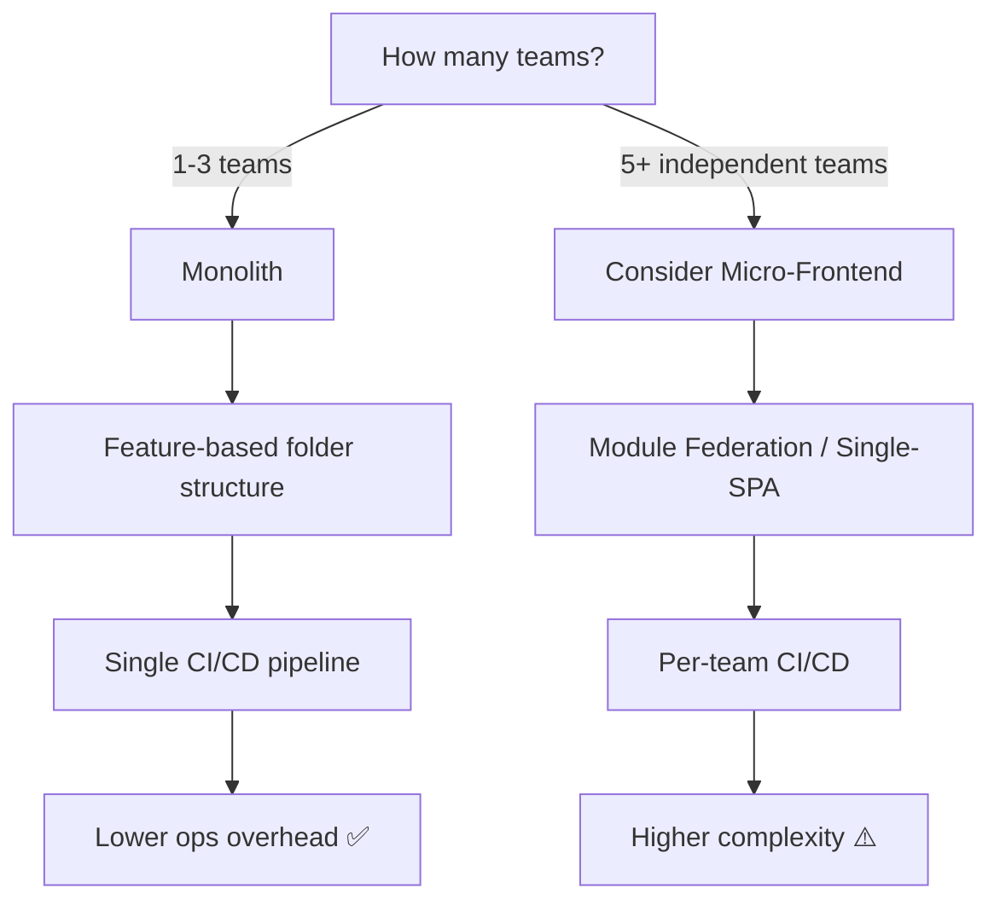
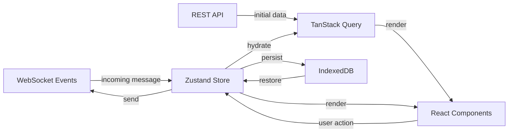

# 🚀 Frontend WhatsApp System Design
### Ultimate Google L5/L6 Interview Preparation Guide
> *"Strong Hire candidates don't memorize answers — they reason from first principles."*

---

## TABLE OF CONTENTS

| # | Section | Key Topics |
|---|---------|-----------|
| 1 | Problem Statement | Scope, Requirements, Assumptions |
| 2 | Requirement Clarification | Interview Communication |
| 3 | Frontend Architecture | SPA, Micro-Frontend, Folder Structure |
| 4 | Component Architecture | Atomic Design, Patterns |
| 5 | State Management | Redux, Zustand, TanStack Query |
| 6 | Real-Time Architecture | WebSocket, SSE, Reconnection |
| 7 | Rendering | CSR, SSR, Virtualization |
| 8 | Performance | Windowing, Memoization, Splitting |
| 9 | UI Design | Chat UI, Accessibility, Responsive |
| 10 | Data Flow | Message Lifecycle End-to-End |
| 11 | Offline Support | IndexedDB, Service Workers, Sync |
| 12 | API Integration | REST, WebSocket, Pagination |
| 13 | Security | XSS, CSRF, CSP, Auth |
| 14 | Testing | Unit, E2E, Performance |
| 15 | Monitoring | Vitals, Logging, Analytics |
| 16 | Scalability | Large Chats, Memory, Media |
| 17 | Trade-offs | All Major Decisions |
| 18 | 100+ Interview Questions | Q&A Ready |
| 19 | Common Mistakes | Why Candidates Fail |
| 20 | Revision Cheat Sheet | One-Page Summary |
| 21 | Strong Hire Answers | What Separates the Best |

---

# 1. 📋 PROBLEM STATEMENT

## What Are We Designing?

A **WhatsApp web/PWA frontend** — a real-time, feature-rich messaging application serving **2 billion+ users globally**. This is a frontend system design problem, meaning we care about the **client-side architecture**, not backend infrastructure.

> 🧠 **Memory Trick:** Think of WhatsApp as **3 Rs** — Real-time, Reliable, Resilient. Every frontend decision should optimize these three.

## Interview Assumptions (State These Upfront!)

```
✅ Web-first (React PWA), mobile as stretch goal
✅ 2B total users, 100M DAU on web
✅ Users send ~50 messages/day average
✅ Mix of text, images, video, voice messages
✅ Support for 1-on-1 and group chats (max 1024 members)
✅ E2E encryption (frontend handles display, not crypto)
✅ Modern browsers: Chrome 90+, Firefox 88+, Safari 14+
```

## Scope (In Scope)

| Feature | Priority | Complexity |
|---------|----------|-----------|
| 1-on-1 real-time chat | P0 | High |
| Group chat (up to 1024 members) | P0 | High |
| Image/video/file sharing | P0 | High |
| Message status (sent/delivered/read) | P0 | Medium |
| Typing indicators | P1 | Medium |
| Online/offline presence | P1 | Medium |
| Voice messages | P1 | Medium |
| Message search | P1 | Medium |
| Status/Stories | P2 | Low |
| Dark mode | P2 | Low |
| Accessibility (WCAG 2.1 AA) | P1 | Medium |

## Out of Scope

```
❌ Voice/Video calls (WebRTC — separate design)
❌ Payments (WhatsApp Pay)
❌ Business API
❌ Desktop native app (Electron)
❌ Backend infrastructure
❌ E2E encryption key management
❌ WhatsApp for Business features
```

## Functional Requirements

```
FR1: Users can send and receive text messages in real-time
FR2: Users can see message delivery status (✓ sent, ✓✓ delivered, blue ✓✓ read)
FR3: Users can share images, videos, documents up to 100MB
FR4: Users can see when others are typing
FR5: Users can see online/last seen status
FR6: Users can participate in groups up to 1024 members
FR7: Users can search through message history
FR8: App works offline with graceful degradation
FR9: Messages sync across devices
FR10: Push notifications when app is backgrounded
```

## Non-Functional Requirements

```
NFR1: Message delivery latency < 100ms (P99 under normal conditions)
NFR2: App loads in < 3 seconds on 4G (LCP < 2.5s)
NFR3: Scrolling 60fps even with 100k messages
NFR4: < 200MB memory usage for average session
NFR5: Offline-first: app opens and shows cached messages with no network
NFR6: 99.9% uptime for frontend assets (CDN-backed)
NFR7: WCAG 2.1 AA accessibility compliance
NFR8: Works on 3-year-old mid-range Android (Chrome)
```

---

# 2. 💬 REQUIREMENT CLARIFICATION

## The Art of Clarifying Questions

> 🎯 **Interviewer Perspective:** We want to see if you **think like a product engineer**. Bad candidates jump to code. Strong Hire candidates spend 5 minutes asking the RIGHT questions.

## Sample Interview Conversation

```
YOU:  "Before I start designing, I'd like to clarify a few things.
      Are we designing the web app, mobile app, or both?"

THEM: "Web app primarily."

YOU:  "Got it. Is this a PWA or a traditional web app?
      That changes our offline story significantly."

THEM: "Think of it as a PWA."

YOU:  "Perfect. What's our target user base size and geography?
      This affects our CDN strategy and real-time infrastructure."

THEM: "2 billion users globally, let's say 100M daily on web."

YOU:  "Understood. Do we need to support end-to-end encryption on
      the frontend? I'll assume we display pre-decrypted content
      and handle key exchange display, not actual crypto implementation."

THEM: "Yes, assume pre-decrypted."

YOU:  "One more — are we supporting multi-device? WhatsApp now
      supports up to 4 linked devices. This changes our sync model."

THEM: "Yes, support multi-device."

YOU:  "Great. Let me state my assumptions and scope, then I'll walk
      through the architecture..."
```

## Questions You MUST Ask

| Category | Question | Why It Matters |
|----------|----------|----------------|
| Platform | Web, mobile, or both? | Changes entire tech stack |
| Scale | How many concurrent users? | WebSocket connection pooling |
| Offline | Required or nice-to-have? | IndexedDB, Service Workers |
| Media | Max file size? Types? | Upload strategy, preview |
| Groups | Max group size? | Fan-out strategy |
| Auth | SSO, phone OTP? | Token refresh strategy |
| Multi-device | Supported? | Sync & conflict resolution |
| Accessibility | WCAG level? | Component architecture |
| Performance budget | Target LCP, FID, CLS? | Architecture constraints |

## Assumptions to State Clearly

> ⚠️ **Interview Tip:** Always say "I'll assume X because Y. If the requirement is different, we'd do Z." This shows engineering judgment, not just memorization.

```
"I'll assume:
- React + TypeScript (ecosystem maturity, team familiarity)
- WebSocket over SSE (bidirectional needed for presence/receipts)
- Cursor-based pagination for messages (not offset — we need stable scrolling)
- IndexedDB for offline storage (5-50MB quota, structured queries)
- Service Workers for push notifications and background sync
- React Query for server state, Zustand for client state
- Monolithic frontend app (micro-frontends add complexity without clear team scale benefit here)"
```

---

# 3. 🏗️ FRONTEND ARCHITECTURE

## Application Architecture Overview

```
┌─────────────────────────────────────────────────────────────────┐
│                     WHATSAPP WEB PWA                            │
├─────────────────────────────────────────────────────────────────┤
│  PRESENTATION LAYER                                              │
│  ┌──────────┐  ┌──────────┐  ┌──────────┐  ┌──────────┐      │
│  │  Chat    │  │ Sidebar  │  │ Status   │  │ Settings │      │
│  │ Feature  │  │ Feature  │  │ Feature  │  │ Feature  │      │
│  └──────────┘  └──────────┘  └──────────┘  └──────────┘      │
├─────────────────────────────────────────────────────────────────┤
│  STATE LAYER                                                     │
│  ┌──────────────┐  ┌───────────────┐  ┌──────────────────┐    │
│  │ Zustand Store│  │ React Query   │  │ WebSocket Store  │    │
│  │ (UI/Session) │  │ (Server State)│  │ (Real-time)      │    │
│  └──────────────┘  └───────────────┘  └──────────────────┘    │
├─────────────────────────────────────────────────────────────────┤
│  SERVICE LAYER                                                   │
│  ┌──────────┐  ┌──────────┐  ┌──────────┐  ┌──────────┐      │
│  │  HTTP    │  │WebSocket │  │IndexedDB │  │  Crypto  │      │
│  │ Service  │  │ Client   │  │ Service  │  │ Service  │      │
│  └──────────┘  └──────────┘  └──────────┘  └──────────┘      │
├─────────────────────────────────────────────────────────────────┤
│  INFRASTRUCTURE LAYER                                           │
│  ┌──────────────────┐  ┌───────────────┐  ┌───────────────┐   │
│  │  Service Worker  │  │ Notification  │  │ IndexedDB     │   │
│  │ (PWA/Cache)      │  │ Manager       │  │ (Persistence) │   │
│  └──────────────────┘  └───────────────┘  └───────────────┘   │
└─────────────────────────────────────────────────────────────────┘
```

## Folder Structure (Feature-Based)

```
src/
├── app/                        # App-wide config
│   ├── App.tsx
│   ├── router.tsx              # React Router v6
│   ├── providers.tsx           # All context providers
│   └── store.ts                # Zustand root store
│
├── features/                   # Domain features (core of app)
│   ├── chat/
│   │   ├── components/
│   │   │   ├── MessageBubble/
│   │   │   │   ├── MessageBubble.tsx
│   │   │   │   ├── MessageBubble.test.tsx
│   │   │   │   └── index.ts
│   │   │   ├── MessageList/
│   │   │   ├── ChatInput/
│   │   │   ├── TypingIndicator/
│   │   │   └── ReadReceipt/
│   │   ├── hooks/
│   │   │   ├── useMessages.ts
│   │   │   ├── useTypingIndicator.ts
│   │   │   └── useSendMessage.ts
│   │   ├── services/
│   │   │   ├── messageService.ts
│   │   │   └── messageCache.ts
│   │   ├── store/
│   │   │   └── chatStore.ts
│   │   └── types/
│   │       └── message.types.ts
│   │
│   ├── sidebar/
│   ├── media/
│   ├── presence/
│   ├── notifications/
│   └── auth/
│
├── shared/                     # Cross-feature shared code
│   ├── components/
│   │   ├── Avatar/
│   │   ├── Button/
│   │   ├── Modal/
│   │   └── VirtualList/
│   ├── hooks/
│   │   ├── useWebSocket.ts
│   │   ├── useInfiniteScroll.ts
│   │   └── useOnlineStatus.ts
│   ├── services/
│   │   ├── websocket.service.ts
│   │   ├── http.service.ts
│   │   └── indexeddb.service.ts
│   └── utils/
│
├── workers/
│   ├── service-worker.ts       # PWA service worker
│   └── encryption.worker.ts    # Crypto in Web Worker
│
└── types/                      # Global TypeScript types
```

## Micro-Frontend vs Monolith Decision

| Dimension | Monolith (Our Choice) | Micro-Frontend |
|-----------|----------------------|----------------|
| Team Size | ≤ 20 engineers | > 50 engineers |
| Deploy | Single deploy | Independent deploy per team |
| Performance | Better (no federation overhead) | Module Federation adds ~50KB |
| Complexity | Low | High (routing, shared deps, auth) |
| When to use | Single product team | Multiple autonomous teams |

> 🎯 **Interview Answer:** "For WhatsApp web, I'd recommend a **modular monolith** — a single deployable unit with strict feature boundaries. Micro-frontends add operational complexity (Module Federation, shared auth, separate CI/CD) that only pays off when teams need truly independent deployment. We get clean separation via our folder structure without the overhead."

### Mermaid: Architecture Decision Flow



---

# 4. 🧩 COMPONENT ARCHITECTURE

## Atomic Design for WhatsApp

```
ATOMS (Smallest, no logic)
├── Button
├── Avatar
├── Icon
├── Badge (unread count)
├── Timestamp
├── Spinner
└── Checkbox (message select)

MOLECULES (Combine atoms, light logic)
├── MessageBubble = Avatar + Text + Timestamp + ReadReceipt
├── ContactRow = Avatar + Name + LastMessage + Badge
├── SearchResult = Avatar + Name + MatchedText
└── TypingIndicator = Avatar + AnimatedDots

ORGANISMS (Full features, business logic)
├── MessageList = VirtualList + MessageBubbles + DateDividers
├── ChatInput = Textarea + EmojiPicker + AttachButton + SendButton
├── ConversationList = SearchBar + ContactRows + Filter
└── MediaViewer = Image/Video + Controls + Download

TEMPLATES (Layout, no data)
├── ChatTemplate = Sidebar + Main
└── SettingsTemplate = Nav + Content

PAGES (Data fetching, route entry)
├── ChatPage → fetches messages, connects WebSocket
└── AuthPage → handles OTP flow
```

## Smart vs Dumb Component Pattern

```tsx
// ❌ BAD: Dumb component doing data fetching
const MessageBubble = ({ messageId }: { messageId: string }) => {
  const [message, setMessage] = useState(null);
  useEffect(() => { fetch(`/messages/${messageId}`) ... }, [messageId]);
  // Now this component can't be reused in Storybook without a real API
}

// ✅ GOOD: Separate smart (container) and dumb (presentational)
// Smart Container — manages data
const MessageBubbleContainer = ({ messageId }: Props) => {
  const message = useMessage(messageId); // custom hook
  return <MessageBubble message={message} onReact={handleReact} />;
};

// Dumb Presentational — pure UI, fully testable
const MessageBubble = ({ message, onReact }: Props) => {
  return (
    <div className={`bubble ${message.isOwn ? 'outgoing' : 'incoming'}`}>
      <p>{message.text}</p>
      <ReadReceipt status={message.status} />
    </div>
  );
};
```

> 🧠 **Memory Trick:** Smart = knows **WHERE** data comes from. Dumb = knows **HOW** to show it. Like a chef (smart) vs a waiter (dumb).

## Component Composition Pattern

```tsx
// Prefer composition over configuration
// ❌ BAD: Prop drilling hell
<MessageList
  showTimestamps={true}
  showAvatars={false}
  showReactions={true}
  bubbleStyle="rounded"
  ...20 more props
/>

// ✅ GOOD: Composition
<MessageList>
  {messages.map(msg => (
    <MessageBubble key={msg.id}>
      <MessageBubble.Text>{msg.text}</MessageBubble.Text>
      <MessageBubble.Timestamp>{msg.time}</MessageBubble.Timestamp>
      <MessageBubble.Reactions reactions={msg.reactions} />
    </MessageBubble>
  ))}
</MessageList>
```

## Controlled vs Uncontrolled Components

| Aspect | Controlled | Uncontrolled |
|--------|-----------|--------------|
| State location | React state | DOM |
| Use case | Chat input, search | File upload input |
| Validation | Instant, per keystroke | On submit |
| Testing | Easy (pure functions) | Requires DOM |
| WhatsApp Usage | Message input ✅ | File picker ✅ |

---

# 5. 🗄️ STATE MANAGEMENT

## State Categories in WhatsApp

```
┌─────────────────────────────────────────────────────────┐
│                    STATE TAXONOMY                        │
├──────────────┬──────────────────────────────────────────┤
│ LOCAL STATE  │ Emoji picker open, input focus,           │
│ (useState)   │ hover states, scroll position             │
├──────────────┼──────────────────────────────────────────┤
│ GLOBAL STATE │ Current user, active chat, theme,         │
│ (Zustand)    │ notification settings, selected messages  │
├──────────────┼──────────────────────────────────────────┤
│ SERVER STATE │ Message history, contact list,            │
│ (TanStack Q) │ group info, user profiles                 │
├──────────────┼──────────────────────────────────────────┤
│ REAL-TIME    │ Incoming messages, typing indicators,     │
│ (WebSocket)  │ online status, delivery receipts          │
├──────────────┼──────────────────────────────────────────┤
│ PERSISTENT   │ Cached messages, draft messages,          │
│ (IndexedDB)  │ media cache, auth tokens                  │
└──────────────┴──────────────────────────────────────────┘
```

## State Architecture Decision



## Zustand Store Design

```tsx
// ✅ WhatsApp Zustand Store (Production Pattern)
interface ChatStore {
  // State
  activeConversationId: string | null;
  conversations: Map<string, Conversation>;
  messages: Map<string, Message[]>; // conversationId → messages
  typingUsers: Map<string, Set<string>>; // conversationId → userIds
  onlineUsers: Set<string>;
  pendingMessages: Map<string, Message>; // clientId → message (for optimistic UI)

  // Actions
  setActiveConversation: (id: string) => void;
  addMessage: (conversationId: string, message: Message) => void;
  updateMessageStatus: (messageId: string, status: MessageStatus) => void;
  setTyping: (conversationId: string, userId: string, isTyping: boolean) => void;
  addPendingMessage: (message: Message) => void;
  confirmPendingMessage: (clientId: string, serverMessage: Message) => void;
}

const useChatStore = create<ChatStore>((set, get) => ({
  activeConversationId: null,
  conversations: new Map(),
  messages: new Map(),
  typingUsers: new Map(),
  onlineUsers: new Set(),
  pendingMessages: new Map(),

  addMessage: (conversationId, message) =>
    set(state => {
      const existing = state.messages.get(conversationId) ?? [];
      const updated = new Map(state.messages);
      // Deduplication: check if message already exists
      if (!existing.find(m => m.id === message.id)) {
        updated.set(conversationId, [...existing, message].sort(byTimestamp));
      }
      return { messages: updated };
    }),

  updateMessageStatus: (messageId, status) =>
    set(state => {
      // Find and update message across all conversations
      const updated = new Map(state.messages);
      for (const [convId, msgs] of updated) {
        const idx = msgs.findIndex(m => m.id === messageId);
        if (idx !== -1) {
          const newMsgs = [...msgs];
          newMsgs[idx] = { ...newMsgs[idx], status };
          updated.set(convId, newMsgs);
          break;
        }
      }
      return { messages: updated };
    }),
}));
```

## TanStack Query for Server State

```tsx
// ✅ Cursor-based infinite messages loading
const useMessages = (conversationId: string) => {
  return useInfiniteQuery({
    queryKey: ['messages', conversationId],
    queryFn: ({ pageParam }) =>
      fetchMessages(conversationId, { cursor: pageParam, limit: 50 }),
    getNextPageParam: (lastPage) => lastPage.nextCursor,
    getPreviousPageParam: (firstPage) => firstPage.prevCursor,
    staleTime: 5 * 60 * 1000, // 5 min — don't refetch too aggressively
    gcTime: 30 * 60 * 1000,   // Keep in cache 30 min
  });
};

// Optimistic updates with TanStack Query
const useSendMessage = () => {
  const queryClient = useQueryClient();

  return useMutation({
    mutationFn: sendMessage,
    onMutate: async (newMessage) => {
      // Cancel outgoing refetches
      await queryClient.cancelQueries({ queryKey: ['messages', newMessage.conversationId] });

      // Snapshot for rollback
      const previous = queryClient.getQueryData(['messages', newMessage.conversationId]);

      // Optimistically add message
      queryClient.setQueryData(['messages', newMessage.conversationId], (old) => ({
        ...old,
        pages: [{ ...old.pages[0], messages: [optimisticMessage, ...old.pages[0].messages] }],
      }));

      return { previous };
    },
    onError: (err, variables, context) => {
      // Rollback on error
      queryClient.setQueryData(['messages', variables.conversationId], context.previous);
    },
    onSettled: (data, error, variables) => {
      // Replace optimistic with real
      queryClient.invalidateQueries({ queryKey: ['messages', variables.conversationId] });
    },
  });
};
```

## State Management Comparison

| Library | Bundle | Learning Curve | DevTools | Async | WhatsApp Fit |
|---------|--------|---------------|---------|-------|-------------|
| Zustand | 8KB | Low | ✅ | Manual | ✅ Best for global UI |
| Redux Toolkit | 45KB | Medium | ✅✅ | Thunks/RTK Query | ⚠️ Overkill |
| Jotai | 4KB | Low | ✅ | Atoms | ✅ Good |
| Recoil | 21KB | Medium | ✅ | Selectors | ⚠️ Meta-specific |
| MobX | 50KB | High | ✅ | Actions | ❌ Mutation model |
| Context API | 0KB | Low | ❌ | N/A | ❌ Re-render issues |

> ⚠️ **Context API Gotcha:** Every consumer re-renders when ANY value in context changes. For WhatsApp with 1000 messages/min incoming, this would freeze the UI. Use Zustand + selectors to prevent unnecessary re-renders.

---

# 6. ⚡ REAL-TIME ARCHITECTURE

## WebSocket vs SSE vs Polling

| Feature | WebSocket | SSE | Long Polling |
|---------|-----------|-----|-------------|
| Direction | Bidirectional | Server → Client only | Request-response |
| Protocol | WS / WSS | HTTP | HTTP |
| Reconnect | Manual | Automatic | Each request |
| Overhead | Low (frames) | Medium (HTTP headers) | High (new connection) |
| Proxy friendly | ⚠️ Some proxies block | ✅ Pure HTTP | ✅ Pure HTTP |
| WhatsApp fit | ✅ Perfect | ❌ Can't send | ❌ Too slow |

> 🎯 **Why WebSocket for WhatsApp?** We need **bidirectional** real-time: send messages, receive messages, send typing indicators, receive delivery receipts, send read receipts, receive presence updates. SSE is one-way — we'd need REST for sending, which adds complexity.

## WebSocket Client Implementation

```tsx
// ✅ Production WebSocket Service with Reconnection
class WhatsAppWebSocket {
  private ws: WebSocket | null = null;
  private reconnectDelay = 1000; // Start with 1s
  private maxDelay = 30000; // Cap at 30s
  private heartbeatInterval: NodeJS.Timeout | null = null;
  private subscribers = new Map<string, Set<Function>>();
  private messageQueue: OutgoingMessage[] = []; // Buffer while disconnected

  connect(url: string, authToken: string) {
    this.ws = new WebSocket(`${url}?token=${authToken}`);

    this.ws.onopen = () => {
      console.log('WebSocket connected');
      this.reconnectDelay = 1000; // Reset backoff
      this.startHeartbeat();
      this.flushMessageQueue(); // Send buffered messages
    };

    this.ws.onmessage = (event) => {
      const data = JSON.parse(event.data);
      this.dispatch(data.type, data.payload);
    };

    this.ws.onclose = (event) => {
      this.stopHeartbeat();
      if (!event.wasClean) {
        this.scheduleReconnect();
      }
    };

    this.ws.onerror = () => {
      this.ws?.close(); // Triggers onclose → reconnect
    };
  }

  private scheduleReconnect() {
    setTimeout(() => {
      this.connect(this.url, this.authToken);
      // Exponential backoff with jitter
      this.reconnectDelay = Math.min(
        this.reconnectDelay * 2 + Math.random() * 1000,
        this.maxDelay
      );
    }, this.reconnectDelay);
  }

  private startHeartbeat() {
    this.heartbeatInterval = setInterval(() => {
      if (this.ws?.readyState === WebSocket.OPEN) {
        this.ws.send(JSON.stringify({ type: 'PING' }));
      }
    }, 30000); // Every 30 seconds
  }

  send(message: OutgoingMessage) {
    if (this.ws?.readyState === WebSocket.OPEN) {
      this.ws.send(JSON.stringify(message));
    } else {
      this.messageQueue.push(message); // Buffer for reconnect
    }
  }

  private flushMessageQueue() {
    while (this.messageQueue.length > 0) {
      const msg = this.messageQueue.shift()!;
      this.send(msg);
    }
  }

  subscribe(eventType: string, callback: Function) {
    if (!this.subscribers.has(eventType)) {
      this.subscribers.set(eventType, new Set());
    }
    this.subscribers.get(eventType)!.add(callback);
    return () => this.subscribers.get(eventType)!.delete(callback); // Unsubscribe
  }

  private dispatch(type: string, payload: unknown) {
    this.subscribers.get(type)?.forEach(cb => cb(payload));
    this.subscribers.get('*')?.forEach(cb => cb({ type, payload })); // Global listener
  }
}
```

## Typing Indicator Implementation

```tsx
// ✅ Debounced typing indicator (critical for performance)
const useSendTypingIndicator = (conversationId: string) => {
  const wsService = useWebSocketService();
  const isTypingRef = useRef(false);
  
  const sendTypingStart = useCallback(
    debounce(() => {
      if (!isTypingRef.current) {
        isTypingRef.current = true;
        wsService.send({ type: 'TYPING_START', conversationId });
      }
    }, 300),
    [conversationId]
  );

  const sendTypingStop = useCallback(
    debounce(() => {
      isTypingRef.current = false;
      wsService.send({ type: 'TYPING_STOP', conversationId });
    }, 1500), // Stop after 1.5s of no typing
    [conversationId]
  );

  const onKeyPress = useCallback(() => {
    sendTypingStart();
    sendTypingStop(); // Debounced stop
  }, [sendTypingStart, sendTypingStop]);

  return { onKeyPress };
};
```

## Message Delivery State Machine

```
                    SEND
                     │
                     ▼
             ┌──────────────┐
             │   PENDING    │ (Client only, clock icon ⏳)
             │  (optimistic)│
             └──────┬───────┘
                    │ WebSocket delivered to server
                    ▼
             ┌──────────────┐
             │     SENT     │ (Single tick ✓)
             └──────┬───────┘
                    │ Recipient's device received it
                    ▼
             ┌──────────────┐
             │  DELIVERED   │ (Double tick ✓✓)
             └──────┬───────┘
                    │ Recipient opened the chat
                    ▼
             ┌──────────────┐
             │     READ     │ (Blue double tick ✓✓)
             └──────────────┘
                    │
             FAILED ← Network error at any stage
```

## Presence System

```tsx
// Real-time presence with batched updates
const usePresence = () => {
  const updatePresence = useChatStore(s => s.updateUserPresence);

  useWebSocketEvent('PRESENCE_UPDATE', (payload: PresencePayload) => {
    // Batch multiple presence updates to avoid render thrashing
    // Server sends batched updates every 10s for inactive users
    startTransition(() => {
      payload.updates.forEach(({ userId, status, lastSeen }) => {
        updatePresence(userId, status, lastSeen);
      });
    });
  });
};

// Display: "last seen today at 3:42 PM" vs "online"
const formatLastSeen = (status: UserStatus, lastSeen: Date): string => {
  if (status === 'ONLINE') return 'online';
  const diff = Date.now() - lastSeen.getTime();
  if (diff < 60_000) return 'just now';
  if (diff < 3600_000) return `last seen ${Math.floor(diff / 60_000)} min ago`;
  if (isToday(lastSeen)) return `last seen today at ${format(lastSeen, 'h:mm a')}`;
  if (isYesterday(lastSeen)) return `last seen yesterday at ${format(lastSeen, 'h:mm a')}`;
  return `last seen ${format(lastSeen, 'MMM d')}`;
};
```

---

# 7. 🎨 RENDERING

## Rendering Strategy for WhatsApp

| Strategy | Definition | WhatsApp Use Case |
|----------|-----------|-------------------|
| CSR | Browser renders everything | Main chat app ✅ |
| SSR | Server renders initial HTML | Login/marketing pages ✅ |
| SSG | HTML at build time | Privacy policy, FAQ ✅ |
| ISR | SSG + periodic regeneration | Not needed |
| Streaming | SSR in chunks | Not needed for chat |

> 🎯 **Interview Answer:** "WhatsApp web is fundamentally a **CSR application**. Here's why: chat doesn't need SEO (no crawlable content), users are always authenticated (no benefit to pre-rendering), and message content is dynamic and personalized. We'd use SSR only for the marketing/auth pages."

## Virtual Scrolling (Critical for 100k+ Messages)

```
PROBLEM: Render 100,000 messages → 100,000 DOM nodes → browser OOM

SOLUTION: Virtual/Windowed List — only render visible items

┌─────────────────────────────────┐
│ VIEWPORT (what user sees)       │
│  ┌─────────────────────────┐   │  ← Only ~20 DOM nodes rendered
│  │  Message 4,521          │   │
│  │  Message 4,522          │   │
│  │  Message 4,523          │   │
│  │  ...                    │   │
│  │  Message 4,540          │   │
│  └─────────────────────────┘   │
│                                 │
│ VIRTUAL SPACE (no DOM nodes)    │
│ Messages 1 - 4,520 = spacer div│  ← Height calculated, no DOM
│ Messages 4,541+ = spacer div   │  ← Height calculated, no DOM
└─────────────────────────────────┘
```

```tsx
// ✅ React Virtuoso — best for chat (dynamic heights, sticky dates)
import { Virtuoso } from 'react-virtuoso';

const MessageList = ({ conversationId }: Props) => {
  const { data, fetchPreviousPage, hasPreviousPage } = useInfiniteMessages(conversationId);
  const messages = useMemo(() => data?.pages.flatMap(p => p.messages) ?? [], [data]);

  return (
    <Virtuoso
      data={messages}
      firstItemIndex={messages.length} // Required for prepend (load older messages)
      initialTopMostItemIndex={messages.length - 1} // Start at bottom
      startReached={() => {
        if (hasPreviousPage) fetchPreviousPage(); // Load older messages
      }}
      itemContent={(index, message) => (
        <MessageBubble key={message.id} message={message} />
      )}
      components={{
        Header: () => hasPreviousPage ? <LoadingSpinner /> : <ConversationStart />,
      }}
      followOutput="smooth" // Auto-scroll on new message if at bottom
    />
  );
};
```

## Hydration & React Concurrent Features

```tsx
// ✅ Use startTransition for non-urgent updates (typing, search)
const handleSearch = (query: string) => {
  startTransition(() => {
    setSearchResults(filterMessages(query)); // Non-blocking
  });
};

// ✅ Use useDeferredValue for expensive renders
const MessageSearch = ({ query }: Props) => {
  const deferredQuery = useDeferredValue(query);
  const results = useMemo(() => searchMessages(deferredQuery), [deferredQuery]);
  // UI stays responsive; search results update when browser is free
  return <SearchResults results={results} isPending={query !== deferredQuery} />;
};
```

---

# 8. 🚀 PERFORMANCE

## Performance Budget for WhatsApp

```
METRIC              TARGET    MEASUREMENT
────────────────────────────────────────
LCP (Largest CP)    < 2.5s    Chat list renders
FID / INP           < 100ms   Input response
CLS                 < 0.1     No layout shift from avatar loads
TTI                 < 4.0s    Chat interactive
Bundle (JS)         < 200KB   Initial (gzipped)
Memory              < 200MB   After 1hr session
Frame Rate          60fps     Scrolling chat
```

## Memoization Strategy

```tsx
// ✅ React.memo with custom comparison
const MessageBubble = memo(({ message, currentUserId }: Props) => {
  return (
    <div className={`bubble ${message.senderId === currentUserId ? 'own' : ''}`}>
      <p>{message.text}</p>
      <ReadReceipt status={message.status} />
    </div>
  );
}, (prev, next) => {
  // Only re-render if content or status changes
  // Status changes (sent→delivered→read) are common — not text
  return prev.message.id === next.message.id &&
         prev.message.status === next.message.status &&
         prev.message.text === next.message.text;
});

// ✅ useMemo for expensive computations
const conversationList = useMemo(() =>
  conversations
    .filter(conv => conv.isActive)
    .sort((a, b) => b.lastMessage.timestamp - a.lastMessage.timestamp)
    .slice(0, 50), // Limit initial render
  [conversations]
);

// ✅ useCallback for stable function references
const handleMessageSelect = useCallback((messageId: string) => {
  setSelectedMessages(prev => {
    const next = new Set(prev);
    next.has(messageId) ? next.delete(messageId) : next.add(messageId);
    return next;
  });
}, []); // No dependencies = stable reference
```

## Bundle Optimization

```tsx
// ✅ Route-based code splitting
const ChatPage = lazy(() => import('./features/chat/ChatPage'));
const StatusPage = lazy(() => import('./features/status/StatusPage'));
const CallsPage = lazy(() => import('./features/calls/CallsPage'));

// ✅ Component-level splitting for heavy components
const EmojiPicker = lazy(() =>
  import('@emoji-mart/react').then(m => ({ default: m.Picker }))
); // Emoji picker is 200KB+ — load on demand

// ✅ Media viewer split (not needed on initial load)
const MediaViewer = lazy(() => import('./features/media/MediaViewer'));

// Vite config for optimal splitting
// vite.config.ts
build: {
  rollupOptions: {
    output: {
      manualChunks: {
        'vendor-react': ['react', 'react-dom'],
        'vendor-state': ['zustand', '@tanstack/react-query'],
        'vendor-virtual': ['react-virtuoso'],
        'vendor-media': ['wavesurfer.js'], // Voice message player
      }
    }
  }
}
```

## Image Optimization

```tsx
// ✅ Progressive image loading with blur placeholder
const ChatImage = ({ src, blurhash, width, height }: Props) => {
  const [loaded, setLoaded] = useState(false);

  return (
    <div className="image-container" style={{ aspectRatio: `${width}/${height}` }}>
      {/* Blur placeholder while loading */}
      {!loaded && <BlurhashCanvas hash={blurhash} className="placeholder" />}

      {/* Intersection Observer — only load when in viewport */}
       setLoaded(true)}
        className={`chat-image ${loaded ? 'loaded' : 'hidden'}`}
        decoding="async" // Don't block main thread
      />
    </div>
  );
};

// ✅ WebP with JPEG fallback
// Server provides: image.webp (40% smaller) + image.jpg (fallback)
<picture>
  <source srcSet="image.webp" type="image/webp" />
  
</picture>
```

## Web Workers for Crypto

```tsx
// ✅ Move expensive operations off main thread
// encryption.worker.ts
self.addEventListener('message', async (event) => {
  const { type, payload } = event.data;
  if (type === 'ENCRYPT_MESSAGE') {
    const encrypted = await encryptWithSignalProtocol(payload);
    self.postMessage({ type: 'ENCRYPTED', payload: encrypted });
  }
});

// Main thread — non-blocking
const cryptoWorker = new Worker('./encryption.worker.ts', { type: 'module' });

const sendEncryptedMessage = async (text: string) => {
  return new Promise((resolve) => {
    cryptoWorker.postMessage({ type: 'ENCRYPT_MESSAGE', payload: text });
    cryptoWorker.onmessage = (e) => {
      if (e.data.type === 'ENCRYPTED') resolve(e.data.payload);
    };
  });
};
```

---

# 9. 🎨 UI DESIGN

## Chat Screen Layout

```
┌──────────────────────────────────────────────────────────┐
│ SIDEBAR (320px)          │ CHAT PANEL (flex-1)           │
├──────────────────────────┤                               │
│ ┌──────────────────────┐ │ ┌────────────────────────┐   │
│ │ Search & Filter      │ │ │ CHAT HEADER            │   │
│ └──────────────────────┘ │ │ Avatar Name Online     │   │
│ ┌──────────────────────┐ │ └────────────────────────┘   │
│ │ CONVERSATION LIST    │ │ ┌────────────────────────┐   │
│ │ (Virtualized)        │ │ │ MESSAGE LIST           │   │
│ │ ┌──────────────────┐ │ │ │ (Virtual scroll)       │   │
│ │ │ 👤 Alice  3:45pm │ │ │ │                        │   │
│ │ │ Hey where are... │ │ │ │  ┌──────────────────┐ │   │
│ │ │              [2] │ │ │ │  │  Hi there! 10:00 │ │   │
│ │ └──────────────────┘ │ │ │  └──────────────────┘ │   │
│ │ ┌──────────────────┐ │ │ │  ┌──────────┐         │   │
│ │ │ 👥 Team Chat     │ │ │ │  │ Hello!   │ ✓✓ blue │   │
│ │ │ Bob: Looking ... │ │ │ │  │   10:01  │         │   │
│ │ └──────────────────┘ │ │ │  └──────────┘         │   │
│ └──────────────────────┘ │ └────────────────────────┘   │
│                          │ ┌────────────────────────┐   │
│                          │ │ Alice is typing...      │   │
│                          │ └────────────────────────┘   │
│                          │ ┌────────────────────────┐   │
│                          │ │ 😊 📎 [  Type here...] │   │
│                          │ └────────────────────────┘   │
└──────────────────────────┴───────────────────────────────┘
```

## CSS Architecture

```css
/* Design tokens — change theme by swapping tokens */
:root {
  --wa-green: #25d366;
  --wa-dark-green: #128c7e;
  --wa-light-green: #dcf8c6; /* Outgoing bubble */
  --wa-white: #fff;
  --wa-sidebar-bg: #ffffff;
  --wa-chat-bg: #e5ddd5;
  --wa-bubble-out: #dcf8c6;
  --wa-bubble-in: #ffffff;
  --wa-text: #111b21;
}

[data-theme="dark"] {
  --wa-sidebar-bg: #111b21;
  --wa-chat-bg: #0d1418;
  --wa-bubble-out: #005c4b;
  --wa-bubble-in: #202c33;
  --wa-text: #e9edef;
}

/* Responsive: collapse sidebar on mobile */
@media (max-width: 768px) {
  .sidebar { width: 100%; }
  .chat-panel { display: none; }
  .sidebar.has-active-chat { display: none; }
  .chat-panel.has-active-chat { display: flex; width: 100%; }
}
```

## Accessibility Checklist

```
✅ All interactive elements keyboard-navigable (Tab, Enter, Space, Escape)
✅ ARIA labels: role="log" for message list, aria-live="polite" for new messages
✅ Screen reader: announces new messages
✅ Focus management: focus moves to chat panel when conversation opened
✅ Color contrast: 4.5:1 minimum (WCAG AA)
✅ Don't rely on color alone (read receipts have icon + color)
✅ Images: always alt text
✅ Emoji: aria-label="Heart eyes emoji"
✅ Reduced motion: @media (prefers-reduced-motion) { no animations }
✅ Font scaling: app works at 200% zoom
```

---

# 10. 📊 DATA FLOW

## Message Lifecycle — Complete End-to-End

```
USER TYPES         UI            STORE          SERVICE         NETWORK         SERVER
───────────        ────          ─────          ───────         ───────         ──────
"Hello!"
  │
  ▼
ChatInput.onChange
  │ (local state)
  ▼
Press Send
  │
  ▼
handleSend()
  │
  ├─────────────► addPendingMessage    (optimistic UI shows ⏳)
  │               (clientId: uuid-123)
  │
  ├─────────────────────────────────────────────────────► WebSocket.send({
  │                                                         type: 'MESSAGE',
  │                                                         clientId: 'uuid-123',
  │                                                         content: 'Hello!',
  │                                                         conversationId: 'conv-456'
  │                                                       })
  │
  │                                                                         ─── Store to Cassandra
  │                                                                         ─── Publish to Kafka
  │                                                                         ─── Assign serverId
  │
  │◄───────────────────────────────────────────────────── ACK({
  │                                                         clientId: 'uuid-123',
  │                                                         serverId: 'msg-789',
  │                                                         timestamp: 1234567890
  │                                                       })
  │
  ▼
confirmPendingMessage('uuid-123', { id: 'msg-789', status: 'SENT' })
  │ (replace ⏳ with ✓)
  ▼

RECIPIENT SIDE:
  │◄───────────────────────────────────── DELIVER_MESSAGE({
                                            id: 'msg-789',
                                            content: 'Hello!',
                                            ...
                                          })
  ▼
addMessage() → re-render MessageList
  │
  ├─────────────────────────────────────► DELIVERY_ACK({ messageId: 'msg-789' })
  │                                        (tells server recipient received it)
  │
  │                  [SENDER SEES ✓✓]
  │
  ├── User opens chat →
  ├─────────────────────────────────────► READ_ACK({ messageId: 'msg-789' })
  │
  │                  [SENDER SEES BLUE ✓✓]
```

---

# 11. 📴 OFFLINE SUPPORT

## Offline-First Architecture

```
┌─────────────────────────────────────────────────────────┐
│                  OFFLINE STRATEGY                        │
│                                                         │
│  NETWORK PRESENT                    NETWORK ABSENT      │
│  ┌──────────┐                       ┌──────────────┐   │
│  │  API +   │ ─── sync down ──────► │  IndexedDB   │   │
│  │ WebSocket│ ◄── sync up ──────── │  (local DB)  │   │
│  └──────────┘                       └──────────────┘   │
│                                            │            │
│                                            ▼            │
│                                      App shows          │
│                                      cached messages    │
│                                      Send queued        │
│                                      (retry on reconnect│
└─────────────────────────────────────────────────────────┘
```

## IndexedDB Schema

```
Database: whatsapp-db
├── Store: messages
│   ├── Key: [conversationId, messageId]  (compound)
│   ├── Index: by-conversationId (for querying chat history)
│   └── Index: by-status (for finding pending messages)
│
├── Store: conversations
│   ├── Key: conversationId
│   └── Index: by-lastMessageTime (for sorting sidebar)
│
├── Store: contacts
│   ├── Key: userId
│   └── Index: by-name (for search)
│
├── Store: media-metadata
│   ├── Key: mediaId
│   └── (actual blobs in Cache API, not IndexedDB)
│
└── Store: pending-messages
    ├── Key: clientId
    └── (messages queued for send when offline)
```

```tsx
// ✅ IndexedDB Service with Dexie (recommended wrapper)
import Dexie, { Table } from 'dexie';

class WhatsAppDatabase extends Dexie {
  messages!: Table<Message>;
  conversations!: Table<Conversation>;
  pendingMessages!: Table<PendingMessage>;

  constructor() {
    super('whatsapp-db');
    this.version(1).stores({
      messages: '[conversationId+id], conversationId, timestamp, status',
      conversations: 'id, lastMessageTimestamp',
      pendingMessages: 'clientId, conversationId, createdAt',
    });
  }
}

const db = new WhatsAppDatabase();

// Get messages for a conversation (paginated)
const getMessages = async (conversationId: string, cursor?: string, limit = 50) => {
  let query = db.messages
    .where('conversationId').equals(conversationId)
    .reverse() // Newest first
    .limit(limit);

  if (cursor) {
    query = query.below(cursor); // Before this message ID
  }

  return query.toArray();
};

// Queue message when offline
const queuePendingMessage = async (message: PendingMessage) => {
  await db.pendingMessages.add(message);
};

// On reconnect, send all pending
const flushPendingMessages = async (wsService: WebSocketService) => {
  const pending = await db.pendingMessages.orderBy('createdAt').toArray();
  for (const msg of pending) {
    try {
      await wsService.sendAndAck(msg);
      await db.pendingMessages.delete(msg.clientId);
    } catch {
      break; // If one fails, stop (will retry on next reconnect)
    }
  }
};
```

## Service Worker Strategy

```javascript
// service-worker.ts
import { precacheAndRoute, cleanupOutdatedCaches } from 'workbox-precaching';
import { registerRoute } from 'workbox-routing';
import { NetworkFirst, CacheFirst, StaleWhileRevalidate } from 'workbox-strategies';

// Pre-cache app shell (HTML, CSS, JS)
precacheAndRoute(self.__WB_MANIFEST);
cleanupOutdatedCaches();

// Strategy for API calls: NetworkFirst with IndexedDB fallback
registerRoute(
  ({ url }) => url.pathname.startsWith('/api/'),
  new NetworkFirst({
    networkTimeoutSeconds: 5,
    cacheName: 'api-cache',
  })
);

// Strategy for media: CacheFirst (images don't change)
registerRoute(
  ({ url }) => url.pathname.startsWith('/media/'),
  new CacheFirst({
    cacheName: 'media-cache',
    plugins: [{
      cacheWillUpdate: async ({ response }) => {
        // Only cache successful responses under 50MB
        if (response.status === 200) return response;
        return null;
      }
    }]
  })
);

// Background sync for offline message sending
self.addEventListener('sync', (event) => {
  if (event.tag === 'send-pending-messages') {
    event.waitUntil(syncPendingMessages());
  }
});

// Push notifications
self.addEventListener('push', (event) => {
  const data = event.data?.json();
  event.waitUntil(
    self.registration.showNotification(data.title, {
      body: data.body,
      icon: '/icons/icon-192.png',
      badge: '/icons/badge.png',
      data: { conversationId: data.conversationId },
      tag: data.conversationId, // Replace duplicate notifications
    })
  );
});
```

## Optimistic UI Pattern

```tsx
// ✅ Complete optimistic message send
const useSendMessage = (conversationId: string) => {
  const addPending = useChatStore(s => s.addPendingMessage);
  const confirmPending = useChatStore(s => s.confirmPendingMessage);
  const removePending = useChatStore(s => s.removePendingMessage);

  return useCallback(async (text: string) => {
    const clientId = generateUUID();
    const optimistic: Message = {
      id: clientId,
      clientId,
      text,
      senderId: currentUser.id,
      conversationId,
      timestamp: Date.now(),
      status: 'PENDING', // ⏳
    };

    // 1. Immediately show in UI
    addPending(optimistic);

    // 2. Save to IndexedDB (appears even if tab closes and reopens)
    await db.pendingMessages.add(optimistic);

    try {
      // 3. Send via WebSocket
      const serverMessage = await wsService.sendAndAck({
        type: 'MESSAGE',
        clientId,
        conversationId,
        content: text,
      });

      // 4. Replace optimistic with confirmed
      confirmPending(clientId, serverMessage);
      await db.pendingMessages.delete(clientId);
      await db.messages.put(serverMessage);

    } catch (error) {
      // 5. Show error state (tap to retry)
      removePending(clientId);
      addPending({ ...optimistic, status: 'FAILED' }); // ❌
    }
  }, [conversationId]);
};
```

---

# 12. 🔌 API INTEGRATION

## REST API Endpoints (Frontend Perspective)

```
Authentication
  POST /auth/otp/request     - Request SMS OTP
  POST /auth/otp/verify      - Verify OTP, get JWT
  POST /auth/refresh          - Refresh access token
  POST /auth/logout           - Invalidate session

Conversations
  GET  /conversations         - List conversations (paginated)
  GET  /conversations/:id     - Get conversation details
  POST /conversations         - Create new 1-on-1 chat

Messages
  GET  /conversations/:id/messages?cursor=X&limit=50  - History
  POST /conversations/:id/messages  - Send (fallback if WS fails)

Groups
  POST /groups                - Create group
  PUT  /groups/:id/members    - Add member
  DELETE /groups/:id/members/:userId  - Remove member

Media
  POST /media/upload-url     - Get pre-signed S3 URL
  POST /media/:id/thumbnail  - Request thumbnail generation

Contacts
  GET  /contacts              - Contact list
  GET  /users/search?q=       - Search users
```

## Cursor-Based Pagination

```tsx
// ✅ Cursor pagination for messages (NEVER use offset for chat)
// Why? Offset pagination breaks when new messages arrive:
// Page 1: messages 1-50
// (5 new messages arrive)
// Page 2: messages 51-100 → YOU SEE MESSAGES 46-50 TWICE!

// Cursor = last seen message ID or timestamp
// Page 1: GET /messages?limit=50 → returns msgs + cursor: "msg-50"
// Page 2: GET /messages?limit=50&cursor=msg-50 → msgs before msg-50

const useInfiniteMessages = (conversationId: string) => {
  return useInfiniteQuery({
    queryKey: ['messages', conversationId],
    queryFn: async ({ pageParam }) => {
      const params = new URLSearchParams({ limit: '50' });
      if (pageParam) params.set('cursor', pageParam);

      const response = await httpClient.get(
        `/conversations/${conversationId}/messages?${params}`
      );
      return response.data; // { messages: [], nextCursor: string | null }
    },
    getNextPageParam: (lastPage) => lastPage.nextCursor, // Older messages
    getPreviousPageParam: (firstPage) => firstPage.prevCursor, // Newer msgs
    initialPageParam: undefined,
    staleTime: Infinity, // Messages don't change (immutable)
  });
};
```

## Media Upload Flow

```
┌─────────────┐      1. Request upload URL      ┌──────────────┐
│   Frontend  │ ─────────────────────────────► │   Backend    │
│             │ ◄─────────────────────────────  │              │
│             │      2. Pre-signed S3 URL         │              │
│             │                                   └──────────────┘
│             │      3. PUT directly to S3
│             │ ─────────────────────────────►  ┌──────────────┐
│             │ ◄─────────────────────────────  │     S3       │
│             │      4. Upload complete           └──────────────┘
│             │
│             │      5. Send message with mediaId
│             │ ─────────────────────────────►  ┌──────────────┐
└─────────────┘                                   │   Backend    │
                                                   └──────────────┘

Benefits of pre-signed URLs:
✅ Backend never handles file bytes (saves bandwidth)
✅ Can upload in parallel to multiple S3 regions
✅ Backend validates file type/size BEFORE giving URL
✅ URL expires (e.g., 15 min) — security
```

---

# 13. 🔒 SECURITY

## Authentication & Token Management

```tsx
// ✅ JWT with silent refresh
class AuthService {
  private accessToken: string | null = null;
  private refreshPromise: Promise<string> | null = null; // Prevent parallel refreshes

  getAccessToken(): string | null {
    // Don't store JWT in localStorage — XSS vulnerable!
    // Store in memory (lost on refresh) + refresh token in httpOnly cookie
    return this.accessToken;
  }

  async refreshAccessToken(): Promise<string> {
    // Prevent multiple simultaneous refresh calls (token refresh race)
    if (this.refreshPromise) return this.refreshPromise;

    this.refreshPromise = httpClient.post('/auth/refresh', {}, {
      withCredentials: true // Sends httpOnly cookie with refresh token
    }).then(res => {
      this.accessToken = res.data.accessToken;
      this.refreshPromise = null;
      return this.accessToken;
    });

    return this.refreshPromise;
  }

  setupInterceptors() {
    // Axios interceptor: auto-refresh on 401
    httpClient.interceptors.response.use(null, async (error) => {
      if (error.response?.status === 401 && !error.config._retry) {
        error.config._retry = true;
        const newToken = await this.refreshAccessToken();
        error.config.headers['Authorization'] = `Bearer ${newToken}`;
        return httpClient(error.config);
      }
      return Promise.reject(error);
    });
  }
}
```

## XSS Prevention

```tsx
// ✅ NEVER use dangerouslySetInnerHTML with user content
// ❌ BAD
<div dangerouslySetInnerHTML={{ __html: message.text }} />

// ✅ GOOD — React escapes by default
<p>{message.text}</p>

// ✅ When rendering rich text (links, bold), sanitize first
import DOMPurify from 'dompurify';

const SafeMessage = ({ html }: { html: string }) => {
  const clean = DOMPurify.sanitize(html, {
    ALLOWED_TAGS: ['b', 'i', 's', 'a', 'br'],
    ALLOWED_ATTR: ['href', 'target', 'rel'],
  });
  return <div dangerouslySetInnerHTML={{ __html: clean }} />;
};

// ✅ Always add rel="noopener noreferrer" to external links
const renderLinks = (text: string) =>
  text.replace(
    URL_REGEX,
    (url) => `<a href="${url}" target="_blank" rel="noopener noreferrer">${url}</a>`
  );
```

## Content Security Policy

```
# HTTP headers for WhatsApp web
Content-Security-Policy:
  default-src 'self';
  script-src 'self' 'nonce-{RANDOM}';  # No 'unsafe-inline'!
  style-src 'self' 'unsafe-inline';    # CSS-in-JS needs this
  img-src 'self' data: https://media.whatsapp.net;
  connect-src 'self' wss://ws.whatsapp.com https://api.whatsapp.com;
  media-src 'self' https://media.whatsapp.net;
  worker-src 'self' blob:;
  frame-ancestors 'none';  # No iframing
  upgrade-insecure-requests;
```

---

# 14. 🧪 TESTING

## Testing Pyramid for WhatsApp

```
           /\
          /  \          E2E Tests (10%)
         /    \         Playwright: full user flows
        /──────\        "User sends a message, recipient sees it"
       /        \
      / Integr.  \      Integration Tests (30%)
     / Tests      \     Testing Store + Components together
    /──────────────\    "Sending a message updates the UI correctly"
   /                \
  /   Unit Tests     \  Unit Tests (60%)
 /────────────────────\ Pure functions, hooks, components in isolation
```

```tsx
// Unit Test: Message sorting
describe('sortMessages', () => {
  it('sorts messages by timestamp ascending', () => {
    const messages = [
      { id: '2', timestamp: 2000 },
      { id: '1', timestamp: 1000 },
    ];
    expect(sortMessages(messages)).toEqual([
      { id: '1', timestamp: 1000 },
      { id: '2', timestamp: 2000 },
    ]);
  });
});

// Integration Test: Send message flow
describe('Message sending', () => {
  it('shows optimistic message then confirms it', async () => {
    const { getByPlaceholder, getByText } = render(<ChatPanel conversationId="conv-1" />);
    const input = getByPlaceholder('Type a message...');

    await userEvent.type(input, 'Hello world');
    await userEvent.keyboard('{Enter}');

    // Optimistic — shows immediately
    expect(getByText('Hello world')).toBeInTheDocument();
    expect(getByText('⏳')).toBeInTheDocument(); // Pending status

    // Wait for confirmation
    await waitFor(() => {
      expect(getByText('✓')).toBeInTheDocument(); // Sent
    });
  });
});

// E2E Test with Playwright
test('send and receive message', async ({ browser }) => {
  const alicePage = await browser.newPage();
  const bobPage = await browser.newPage();

  await alicePage.goto('/chat/with-bob');
  await bobPage.goto('/chat/with-alice');

  await alicePage.fill('[placeholder="Type a message..."]', 'Hi Bob!');
  await alicePage.press('Enter');

  // Bob should receive within 2 seconds
  await expect(bobPage.locator('text=Hi Bob!')).toBeVisible({ timeout: 2000 });
});
```

---

# 15. 📊 MONITORING

## Core Web Vitals for WhatsApp

```tsx
// ✅ Web Vitals monitoring
import { onCLS, onFCP, onINP, onLCP, onTTFB } from 'web-vitals';

const reportVital = (metric) => {
  analytics.track('web_vital', {
    name: metric.name,
    value: metric.value,
    rating: metric.rating, // 'good', 'needs-improvement', 'poor'
    conversationId: getCurrentConversationId(),
  });
};

onLCP(reportVital);  // Largest Contentful Paint < 2.5s
onCLS(reportVital);  // Cumulative Layout Shift < 0.1
onINP(reportVital);  // Interaction to Next Paint < 200ms
onFCP(reportVital);  // First Contentful Paint < 1.8s
onTTFB(reportVital); // Time to First Byte < 800ms
```

## Custom Chat Metrics

```
METRIC                      DEFINITION                  TARGET
─────────────────────────────────────────────────────────────────
Message Send Latency        click Send → ✓ appears      < 100ms (P50)
                                                         < 500ms (P99)
Message Display Latency     WS message → DOM visible     < 50ms
Scroll FPS                  FPS during rapid scroll      > 55 fps
Message Load Time           tap conv → first message      < 300ms
Media Load Time             image visible in chat         < 2s
Connection Establishment    page load → WS connected      < 1s
```

---

# 16. 📈 SCALABILITY

## Large Chat Optimization (100k+ Messages)

```
PROBLEM: Group with 1000 members, active for 2 years
= ~5 million messages in one conversation
= CANNOT load all into memory

SOLUTIONS:
1. Virtual scrolling — only render visible ✅
2. Cursor pagination — load 50 at a time ✅
3. Message pruning — remove old from store ✅
4. Search via server — never search client-side ✅
5. IndexedDB as local cache — query without network ✅
```

```tsx
// Memory management: limit messages in store
const MAX_MESSAGES_IN_MEMORY = 500; // Per conversation

const addMessage = (conversationId: string, message: Message) =>
  set(state => {
    const existing = state.messages.get(conversationId) ?? [];
    const updated = [...existing, message];

    // Prune old messages from memory (they're still in IndexedDB)
    const pruned = updated.length > MAX_MESSAGES_IN_MEMORY
      ? updated.slice(updated.length - MAX_MESSAGES_IN_MEMORY)
      : updated;

    return {
      messages: new Map(state.messages).set(conversationId, pruned)
    };
  });
```

---

# 17. ⚖️ FRONTEND TRADE-OFFS

## All Major Architecture Decisions

| Decision | Option A | Option B | Winner | Reason |
|---------|---------|---------|--------|--------|
| Real-time | WebSocket | SSE | WebSocket | Bidirectional needed |
| State | Redux Toolkit | Zustand | Zustand | Simpler, less boilerplate |
| Server state | Redux RTK Query | TanStack Query | TanStack Query | Better infinite scroll |
| Virtual list | react-window | react-virtuoso | react-virtuoso | Handles dynamic heights |
| Storage | localStorage | IndexedDB | IndexedDB | Structured queries, more space |
| Upload | Direct to server | Pre-signed S3 | Pre-signed S3 | No server bandwidth |
| Bundler | Webpack | Vite | Vite | Faster dev, better splitting |
| CSS | CSS Modules | Tailwind | Tailwind | Rapid UI, no unused CSS |
| Architecture | SPA | MPA | SPA | Chat needs persistent WS |
| Testing | Jest+RTL | Vitest+RTL | Vitest | Faster with Vite |
| Error tracking | Sentry | Datadog | Sentry | Better React integration |

---

# 18. ❓ 100+ GOOGLE INTERVIEW QUESTIONS

## Core Architecture
1. How would you architect WhatsApp web from scratch?
2. Why WebSocket over SSE for WhatsApp?
3. How do you handle WebSocket reconnection in production?
4. What's the difference between controlled and uncontrolled components? When would you use each in WhatsApp?
5. How do you prevent memory leaks from WebSocket listeners?
6. Explain your state management strategy. Why not Context API?
7. How would you handle multi-tab synchronization (user opens WhatsApp in 3 tabs)?
8. What is the BroadcastChannel API and how can it help?
9. Why cursor pagination over offset pagination for messages?
10. How do you handle the case where the server is down and the user sends a message?

## Performance
11. How do you render 100,000 messages without freezing the browser?
12. Explain virtual scrolling — how does it work internally?
13. What is the difference between react-window and react-virtuoso?
14. Why is `useMemo` not always a performance improvement?
15. When should you use `useCallback`?
16. How do you prevent unnecessary re-renders in a message list?
17. What is React concurrent mode? How does `startTransition` help?
18. How do you optimize initial bundle size?
19. What is tree shaking and how does Vite implement it?
20. How do you lazy-load the emoji picker?
21. What is the importance of image lazy loading in a chat app?
22. How do you implement image blurhash placeholders?
23. What are Core Web Vitals and how would you optimize them for WhatsApp?
24. What is the Interaction to Next Paint (INP) metric? How do you optimize it?
25. How would you use Web Workers in WhatsApp?
26. What is `requestIdleCallback`? When would you use it?
27. How do you prevent layout thrashing?
28. Explain `requestAnimationFrame` and when you'd use it in a chat app.
29. How do you measure scrolling performance?
30. What is a "paint storm"? How do you avoid it?

## Real-Time
31. Walk me through a message's journey from sending to displaying.
32. How do you implement typing indicators efficiently?
33. How would you debounce typing events?
34. Explain the presence system — online/last seen.
35. How do you handle out-of-order message delivery?
36. What is message deduplication? How do you implement it?
37. How do you implement read receipts (double blue tick)?
38. What happens to messages sent while offline?
39. How do you sync messages when reconnecting?
40. What is optimistic UI? Implement it for WhatsApp.

## State & Data
41. Compare Redux, Zustand, MobX, and Context API for WhatsApp.
42. How would you structure the Zustand store for WhatsApp?
43. When would you use TanStack Query vs Zustand?
44. How do you prevent stale closures in event handlers?
45. How does `useRef` differ from `useState`?
46. How would you implement draft message persistence?
47. How do you handle race conditions in async state updates?
48. What is the "tearing" problem in concurrent React?
49. How does `useSyncExternalStore` help?
50. How do you implement a "select all, delete selected messages" feature?

## Offline & PWA
51. What is a Service Worker? How does it differ from a Web Worker?
52. What caching strategies does Workbox provide?
53. How do you implement background sync?
54. What is IndexedDB? Compare to localStorage.
55. How do you handle IndexedDB schema migrations?
56. What is the Cache Storage API?
57. How do you test offline behavior?
58. What happens when two tabs write to IndexedDB simultaneously?
59. How do you implement push notifications?
60. What is a manifest.json and what does it enable?

## Security
61. Why should JWT not be stored in localStorage?
62. What is the difference between XSS and CSRF?
63. How does Content Security Policy prevent XSS?
64. How do you sanitize user-generated HTML in messages?
65. What is a nonce in CSP?
66. How do you implement silent JWT refresh?
67. What is PKCE and when is it used?
68. How do you secure media URLs (prevent unauthorized access)?
69. How do you handle token revocation?
70. What is clickjacking and how do you prevent it?

## Component Design
71. Design the MessageBubble component API.
72. How would you implement a virtualized conversation list?
73. How do you build an accessible chat application?
74. What ARIA roles are used in a message list?
75. How do you implement infinite scroll in a list that also receives new items?
76. Design the emoji picker — what are the performance considerations?
77. How do you implement a voice message recorder?
78. How do you show a smooth scroll-to-bottom on new message?
79. How do you implement "scroll to quoted message"?
80. How would you design a message search feature?

## Testing
81. How do you test a component that uses WebSocket?
82. How do you mock IndexedDB in tests?
83. What is the Testing Library philosophy?
84. Write a test for the optimistic UI message flow.
85. How do you test accessibility?
86. What tools would you use for performance testing?
87. How do you write E2E tests for real-time features?
88. What is visual regression testing?
89. How do you test Service Workers?
90. What is snapshot testing? When is it useful or harmful?

## Advanced / Strong Hire
91. How would you implement WhatsApp's end-to-end encryption key exchange on the frontend?
92. How does the Signal Protocol's Double Ratchet work at a high level?
93. How would you design the frontend for multi-device sync?
94. How do you handle message ordering guarantees on the client?
95. How would you implement "disappearing messages"?
96. How would you design a message reactions feature?
97. How do you implement a "forward message" feature across chats?
98. How would you build message pinning?
99. How do you implement real-time collaborative features (like Google Docs) — is WhatsApp similar?
100. How would you implement the video/audio call UI using WebRTC?
101. How do you build a themeable design system for WhatsApp?
102. How would you approach internationalization (RTL languages like Arabic)?
103. How do you implement font scaling for accessibility?
104. How would you design the WhatsApp Status/Stories feature?

---

# 19. ❌ COMMON MISTAKES

## Why Candidates Fail

| Mistake | What Interviewers See | Correct Approach |
|---------|----------------------|-----------------|
| Skip clarifying questions | Jumps to implementation | Spend 5 min on requirements |
| Use polling instead of WebSocket | Doesn't understand real-time | Explain WS lifecycle and reconnection |
| localStorage for JWT | Security blindspot | httpOnly cookie + memory |
| No virtual scrolling | Scalability blindspot | Explain windowing from first principles |
| Context API for everything | Re-render unawareness | Know Context re-render behavior |
| No offline handling | Feature completeness | Always discuss IndexedDB + SW |
| No error handling | Not production-minded | Retry logic, error states, fallback |
| No accessibility | Missing non-functional req | ARIA, keyboard nav, screen readers |
| No state machine for messages | Poor design thinking | PENDING → SENT → DELIVERED → READ |
| Offset pagination for messages | Data correctness bug | Explain cursor pagination |
| Not mentioning optimistic UI | Poor UX thinking | User sees message instantly |
| No code splitting | Bundle size blindspot | Lazy load emoji picker, media viewer |
| Can't explain trade-offs | Memorized, not understood | For every choice: "I chose X because Y, trade-off is Z" |
| Not discussing monitoring | Not production-aware | Core Web Vitals, custom metrics |
| Missing message deduplication | Distributed systems gap | Client ID + server ID reconciliation |

---

# 20. 📄 REVISION CHEAT SHEET

```
╔══════════════════════════════════════════════════════════════════╗
║           WHATSAPP FRONTEND — ONE-PAGE CHEAT SHEET             ║
╠══════════════════════════════════════════════════════════════════╣
║  ARCHITECTURE:  React + TypeScript + Vite                       ║
║  STATE:         Zustand (UI) + TanStack Query (server)          ║
║  REAL-TIME:     WebSocket (bidirectional) → SSE (1-way no good) ║
║  RENDERING:     CSR (chat) + SSR (marketing only)               ║
║  PERFORMANCE:   react-virtuoso + React.memo + code splitting    ║
║  OFFLINE:       IndexedDB (Dexie) + Service Worker + Workbox    ║
║  PAGINATION:    Cursor-based (NEVER offset for chat)            ║
║  SECURITY:      JWT in memory + httpOnly cookie, DOMPurify, CSP ║
╠══════════════════════════════════════════════════════════════════╣
║  MESSAGE STATES: PENDING → SENT ✓ → DELIVERED ✓✓ → READ 💙✓✓  ║
╠══════════════════════════════════════════════════════════════════╣
║  PERFORMANCE BUDGET:                                             ║
║  LCP < 2.5s | INP < 200ms | CLS < 0.1 | Bundle < 200KB        ║
╠══════════════════════════════════════════════════════════════════╣
║  VIRTUAL SCROLL: Only render ~20 DOM nodes from 100k messages   ║
║  MEMOIZATION: React.memo + useMemo + useCallback (use wisely!)  ║
║  CODE SPLIT: Route-level + Emoji picker + Media viewer          ║
╠══════════════════════════════════════════════════════════════════╣
║  KEY TRADE-OFFS:                                                 ║
║  WS > SSE (bidirectional) | IndexedDB > localStorage (size+query║
║  Zustand > Redux (simplicity) | Cursor > Offset (correctness)   ║
║  Pre-signed S3 > Direct upload (bandwidth)                      ║
╠══════════════════════════════════════════════════════════════════╣
║  WS RECONNECTION: Exponential backoff (1s → 2s → 4s → max 30s) ║
║  HEARTBEAT: Ping every 30s, reconnect if no pong in 5s          ║
║  OFFLINE SEND: Queue in IndexedDB, flush on reconnect           ║
║  OPTIMISTIC UI: Show message immediately, rollback on failure   ║
╚══════════════════════════════════════════════════════════════════╝
```

---

# 21. 🏆 STRONG HIRE ANSWERS

## What Separates Strong Hire from Hire

### 1. System-Level Thinking

> **Hire candidate:** "I'd use WebSocket for real-time messaging."
>
> **Strong Hire:** "I'd use WebSocket for bidirectional real-time. The connection lifecycle matters: on mobile, the OS can kill the WS when backgrounded. I'd implement exponential backoff reconnection with jitter (to prevent thundering herd — imagine 10M users reconnecting simultaneously after a server restart). I'd also queue messages in IndexedDB while disconnected and flush on reconnection. For the WebSocket server, I'd use sticky sessions via consistent hashing so reconnects hit the same server, but design for graceful handoff if that server is unavailable."

### 2. Trade-off Articulation

> **Hire:** "I'd use Zustand because it's simple."
>
> **Strong Hire:** "For state, I'd separate concerns: Zustand for client/UI state (active conversation, selection mode, theme), TanStack Query for server state (message history, contacts), and a WebSocket event bus for real-time updates that feeds both. The key insight: server state and real-time state have different invalidation models. TanStack Query's stale-while-revalidate is perfect for contact lists (changes rarely), but for incoming messages I need immediate consistency — that's the WebSocket store's job. I'd avoid Redux here: the message serialization overhead and boilerplate don't pay off at our team size."

### 3. Failure Scenario Thinking

> **Hire:** "Users can send messages."
>
> **Strong Hire:** "Let me walk through failure modes. User sends message → WebSocket fails mid-send. Solution: assign a clientId UUID before sending, show optimistic UI, persist to IndexedDB pending queue, retry on reconnect. But what if the message DID reach the server before the connection dropped? We'd show it twice. Prevention: server checks clientId for idempotency — if it's a duplicate, it returns the same serverId. Client reconciles by matching clientId. This is why our message state machine needs PENDING, SENT, DELIVERED, READ, and FAILED states — each maps to a specific failure scenario."

### 4. Scalability from First Principles

> **Strong Hire:** "For 100k messages in a group chat, the naive approach — render all 100k DOM nodes — would use ~2GB of memory and freeze the browser. Virtual scrolling solves this: we only render ~20 messages visible in the viewport, calculate heights for the rest as CSS spacers. I'd use react-virtuoso over react-window because it handles dynamic message heights (images vs text). But virtual scrolling alone isn't enough — we also need cursor-based pagination (fetch 50 at a time from server), message pruning from the in-memory store (keep only the 500 nearest to scroll position), and full-text search via the server (never search 100k messages client-side)."

### 5. Security Depth

> **Strong Hire:** "For auth tokens, I'd avoid localStorage entirely — it's vulnerable to XSS. Instead: access token in memory (lost on page refresh, so short-lived, 15 min), refresh token in httpOnly cookie (XSS-safe, lasts 30 days). On page load, call /auth/refresh automatically to get a new access token. For CSRF on the refresh endpoint: SameSite=Strict cookie + CSRF token in header. For message content: DOMPurify with an allowlist (a, b, i, br only) before any HTML rendering. CSP header with nonces for inline scripts. This layered approach means compromising one layer doesn't compromise the whole system."

### 6. Production Mindset

> **Strong Hire proactively mentions:**
> - "I'd instrument message send latency as a custom metric — P50 and P99."
> - "I'd use Sentry with conversation context so errors include what chat was open."
> - "I'd implement feature flags for rolling out new message types."
> - "I'd add a circuit breaker — if the WS server fails to connect 5 times, fall back to long polling."
> - "For multi-device sync: BroadcastChannel API to sync state across tabs in the same browser, and WebSocket events for other devices."

---

> 📌 **Final Note:** The difference between Hire and Strong Hire is not knowing MORE facts — it's **reasoning from first principles**, **anticipating failure modes**, **explaining trade-offs with conviction**, and **showing production awareness**. Every decision should come with: "I chose X because Y, the trade-off is Z, and if the requirement changes to W, I'd switch to V."
